# Flows

End-to-end diagrams for the major paths through Da Vinci. Each section
names the real files and functions involved, so a diagram can be traced
straight into the code.

- [1. System overview](#1-system-overview)
- [2. Data model](#2-data-model)
- [3. Live recording → notes](#3-live-recording--notes)
- [4. File upload → notes](#4-file-upload--notes)
- [5. Recording details](#5-recording-details)
- [6. Typed message → notes](#6-typed-message--notes)
- [7. Routing: notes vs chat](#7-routing-notes-vs-chat)
- [8. User profile](#8-user-profile)
- [9. Conversation creation & cleanup](#9-conversation-creation--cleanup)
- [10. Rendering the notes document](#10-rendering-the-notes-document)

---

## 1. System overview

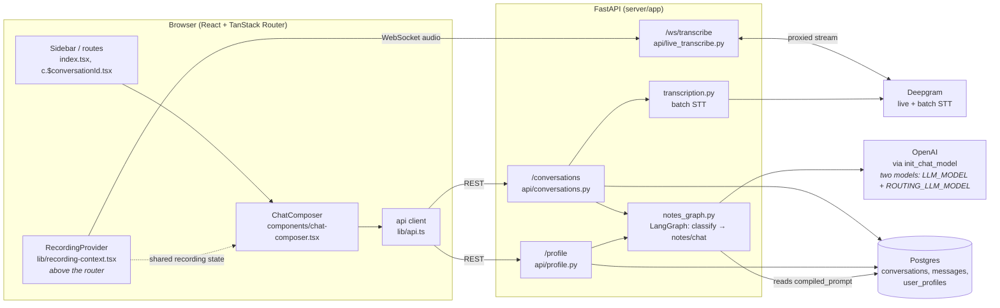

The Deepgram API key never reaches the browser — `/ws/transcribe` proxies the
live stream server-side (`live_transcribe.py`).

---

## 2. Data model

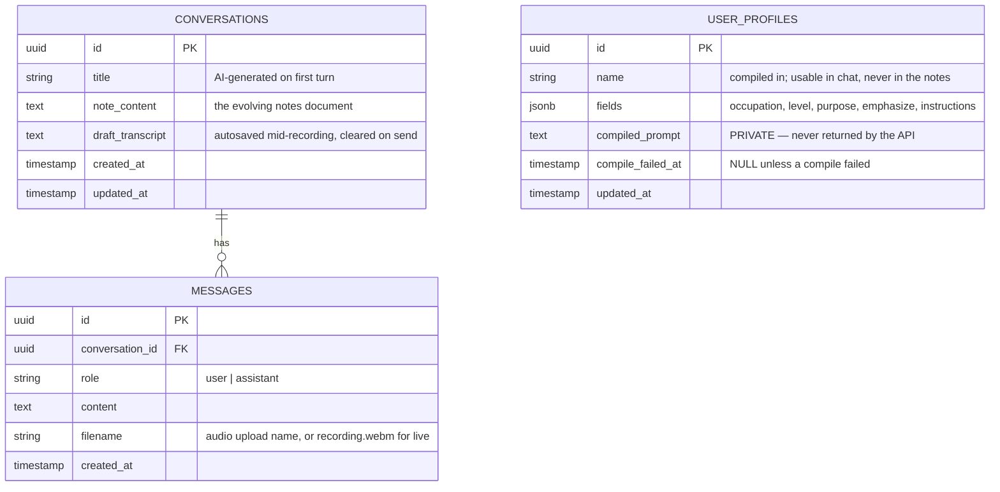

`USER_PROFILES` is a single global row (no auth in this build). Two fields reach
the model differently:

- **`compiled_prompt`** — LLM-written third-person description of the user.
  Private: pasted into prompts, never returned by the API.
- **`fields.instructions`** — the user's own text, passed to the writer
  **verbatim** (skips the compiler).

Everything else the model is told lives as constants in
`services/notes_graph.py`.

---

## 3. Live recording → notes

`MediaRecorder` emits audio chunks every 250ms. Those chunks stream through
`/ws/transcribe` to Deepgram so a transcript appears while you speak. On send,
that transcript is what becomes the user message and what the LLM reads.

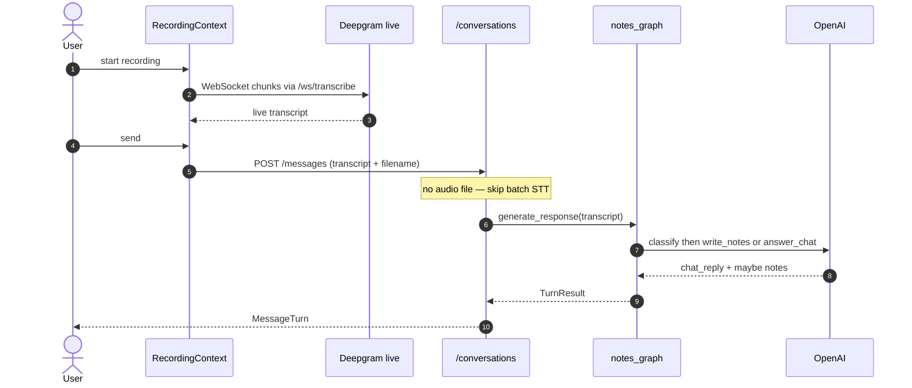

The LLM never hears the audio — only the transcript string. Live send posts
`transcript` plus `filename=recording.webm` (metadata only, no bytes). Batch
Deepgram (for when there is no live text) is the
[file upload](#4-file-upload--notes) path.

Details that used to live in this diagram (eager conversation create, draft
autosave, silence delete, pause) are in [§5](#5-recording-details). How the
graph chooses notes vs chat is in [§7](#7-routing-notes-vs-chat).

---

## 4. File upload → notes

No live transcript — the attached file **is** the blob. The server must
transcribe it.

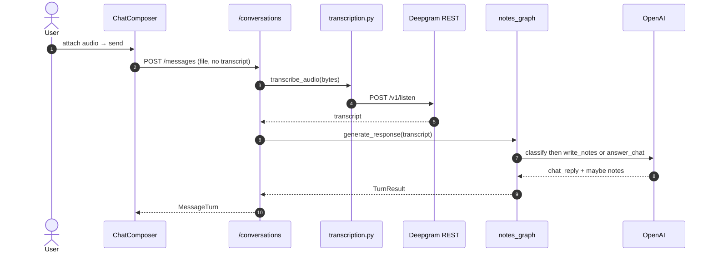

Chat shows a **file chip** (real filename). Live recordings store
`filename=recording.webm` as metadata only (no audio upload) —
`isFileAttachment()` in `message-bubble.tsx` tells them apart. Audio bytes
are not persisted either way; only transcript + filename are.

---

## 5. Recording details

Extras around the live path in §3 — lifecycle, navigation, and crash safety.

### Lifecycle

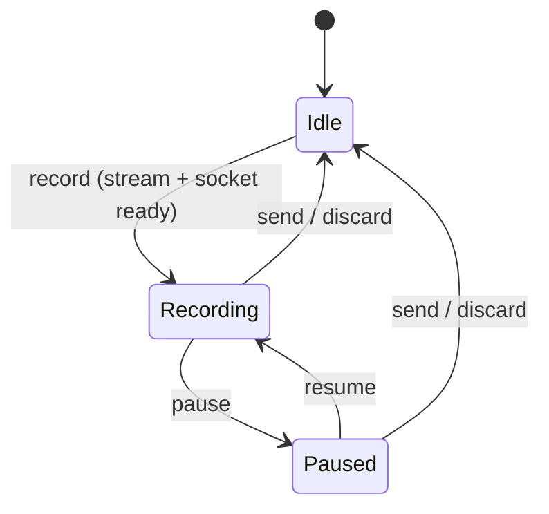

Pause does **not** split the recording — the same MediaRecorder session
keeps streaming chunks to Deepgram.
Discard (or silence on send) deletes the conversation only if it was created
just for that recording and never successfully sent.

### Survives navigation

`RecordingProvider` sits **above** the router, so changing pages does not stop
the mic.

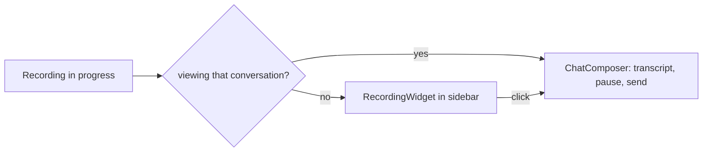

### Draft autosave

Final Deepgram segments (and pause) `PATCH /{id}/draft`. After a crash or
reload, `GET /conversations/{id}` restores `draft_transcript` into the
composer. A successful send clears it. Guards stop late WebSocket finals from
resurrecting a discarded draft (`allowDraftSaveRef`, clear `onmessage` before
close).

---

## 6. Typed message → notes

No audio — only the text form field.

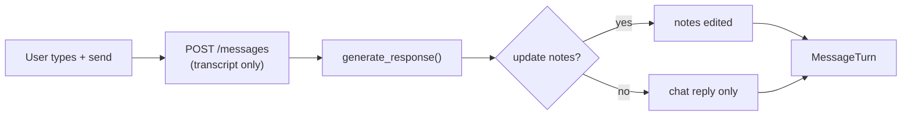

---

## 7. Routing: notes vs chat

Every turn is a **two-step** LangGraph: classify first, then either write notes
or answer in chat.

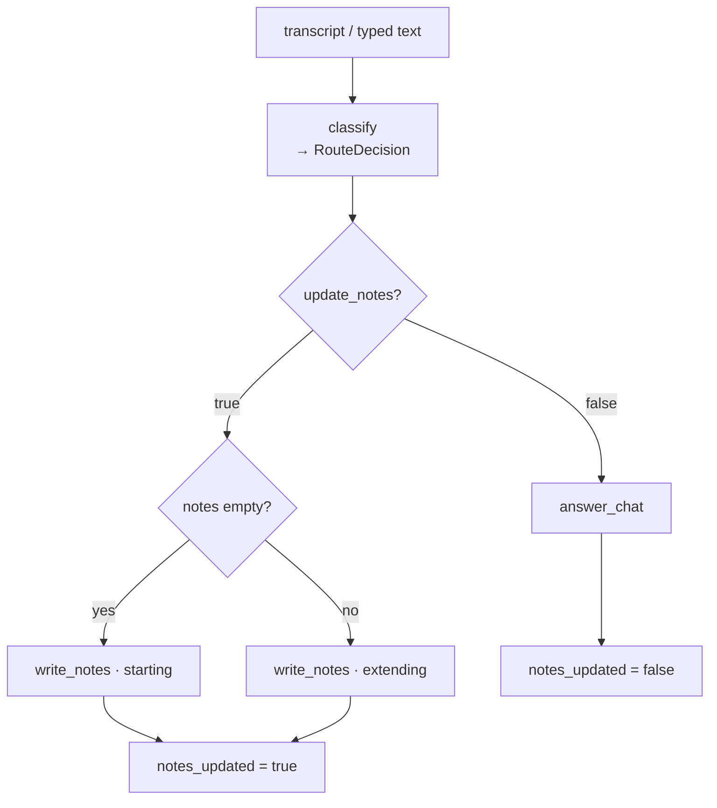

**Why two calls.** The router schema has no `note_content` field, so it
*cannot* rewrite the document. One call asked to “return the full notes”
tended to always return one — filler like `thanks` used to trash the doc.

`conversations.py` only saves notes when `notes_updated` is true.

### What reaches each prompt

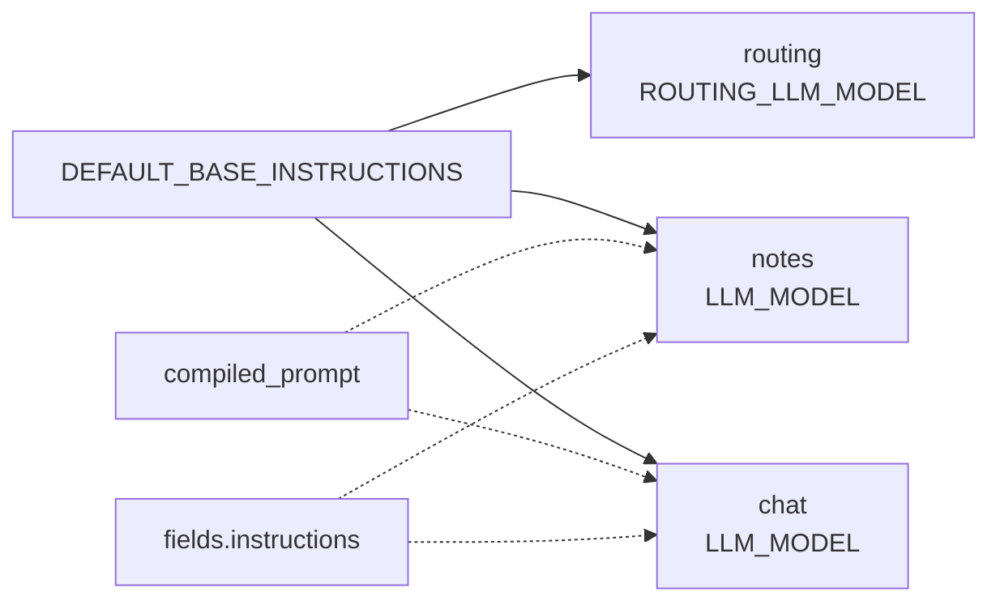

The **router** gets neither profile nor instructions — whether notes should
change is independent of who the user is. Both personalization blocks reach
notes *and* chat. Transcript / notes / history are treated as **data** under
a shared trust-boundary rule in `DEFAULT_BASE_INSTRUCTIONS` (prompt hygiene,
not hard enforcement).

---

## 8. User profile

Form answers are compiled into a private description; Instructions stay as the
user typed them.

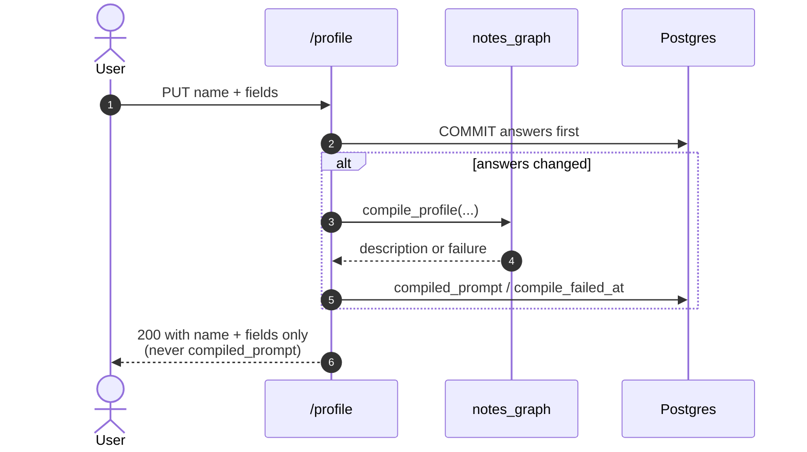

| | Compiled description | Instructions |
|---|---|---|
| Author | LLM from form answers | user |
| Visible | no | yes |
| To the writer | compiled prose | verbatim |
| On compile failure | omit personal layer; notes still generate | unaffected |

If answers exist but `compiled_prompt` is null, the next note job **lazy-retries**
compilation once, then continues without personalization rather than failing
the turn.

---

## 9. Conversation creation & cleanup

Recording needs a conversation id for drafts, so create is **eager** on
record. Typed/upload create **lazily** at send.

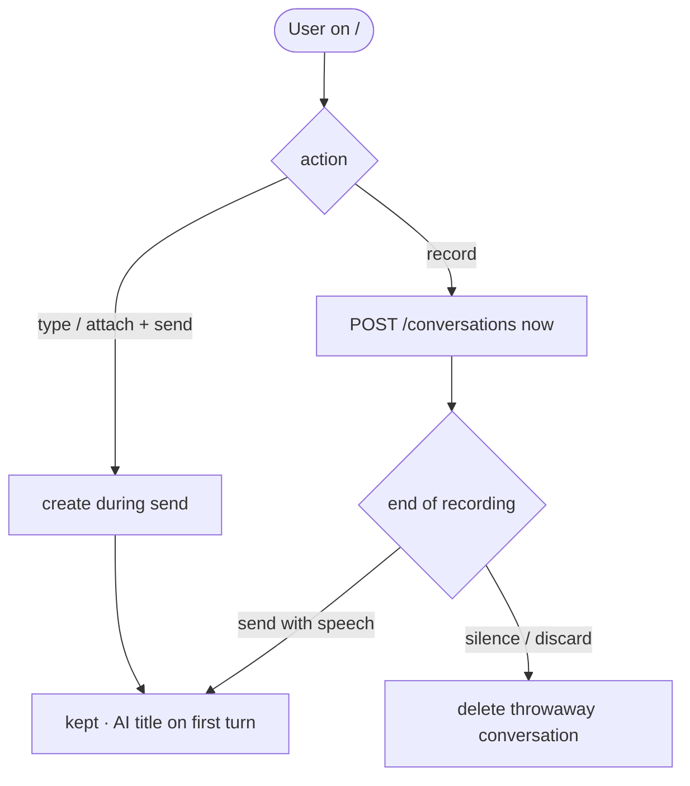

Deleting a conversation always stops any attached recording first.

---

## 10. Rendering the notes document

Model Markdown is untrusted input. Notes panel and assistant chat share one
`<Markdown>` component (`components/markdown.tsx`).

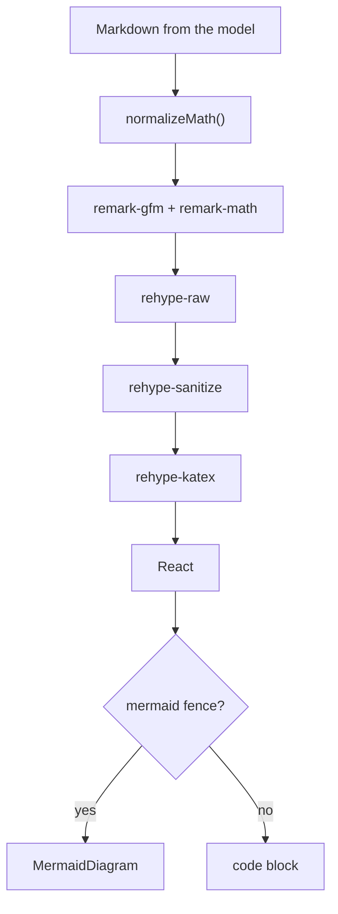

Order matters: **raw → sanitize → katex** (KaTeX injects classes sanitize
would strip). Mermaid is intercepted on `<pre>`, loaded dynamically, and
falls back to source on parse failure so a bad diagram never blanks the
notes.
