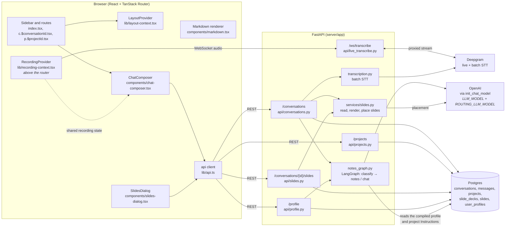
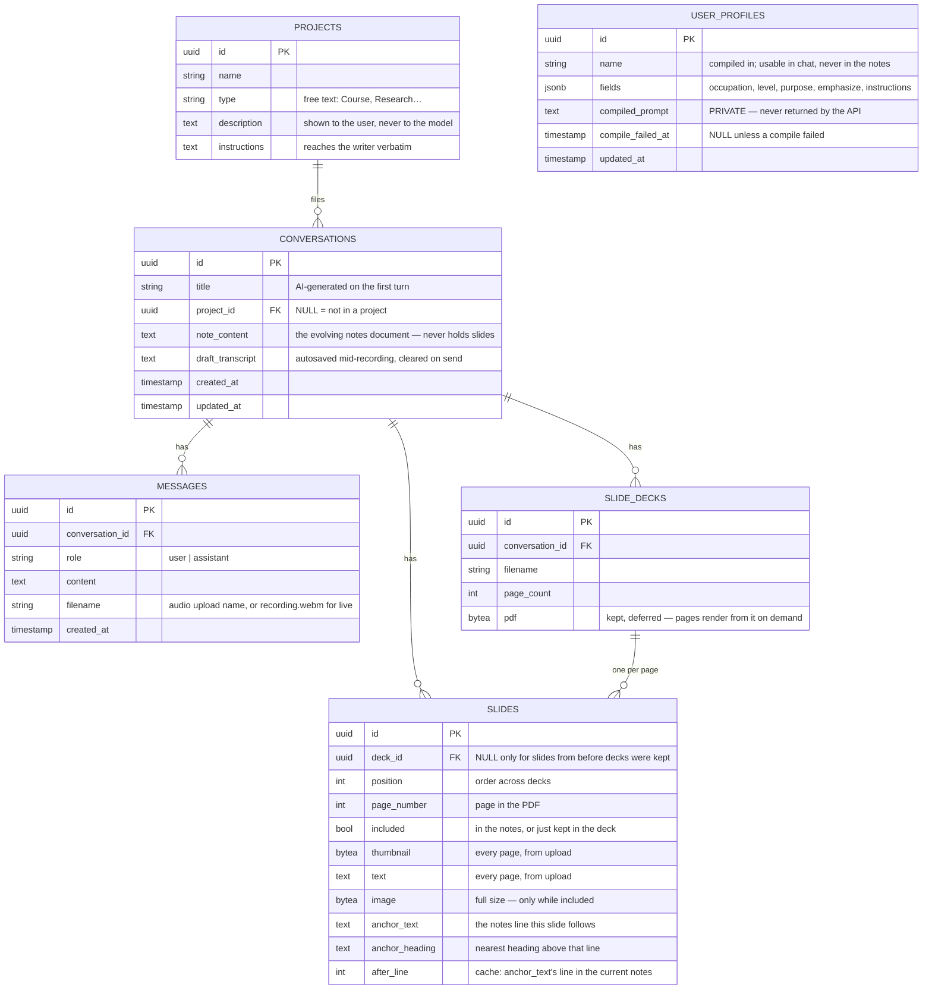
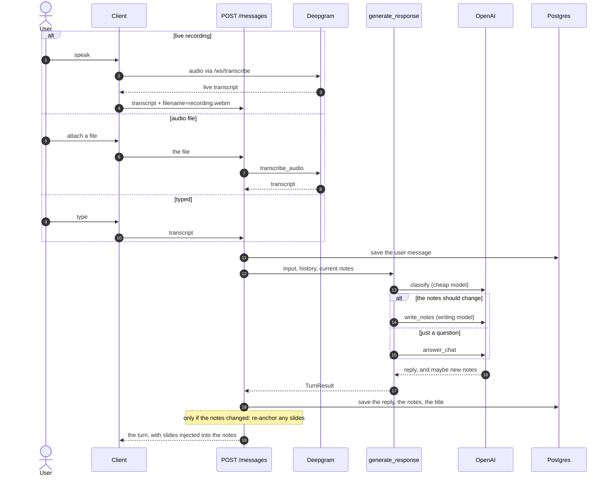

# How Veda fits together

The overview: what the pieces are, how a request travels through them, and where each
kind of state lives. It is deliberately short. The detailed flows — with the real files and
functions named, so a diagram can be traced straight into the code — live in one page per
feature; the [feature map](#4-feature-map) below links to each.

- [1. System overview](#1-system-overview)
- [2. Data model](#2-data-model)
- [3. One turn, end to end](#3-one-turn-end-to-end)
- [4. Feature map](#4-feature-map)
- [5. Where state lives](#5-where-state-lives)

---

## 1. System overview

The Deepgram API key never reaches the browser: `/ws/transcribe` proxies the live stream
server-side. There is no sign-in — one profile row, one set of conversations, global to
whoever opens the page.

---

## 2. Data model

`USER_PROFILES` is a single global row. Deleting a project deletes its conversations, and a
conversation's messages, decks and slides go with it — the foreign keys all cascade.

Everything the model is told is a constant in `services/notes_graph.py`, apart from the
compiled profile (generated per user, so it lives in the database).

---

## 3. One turn, end to end

The path every input takes, whatever form it started in. Each step is expanded in the page
named beside it.

The model never hears audio — only the transcript text. Recording and uploading:
[Transcription](docs/transcription/README.md). The turn itself and why a failure is safe:
[Conversations](docs/conversations/README.md). The two-step model call:
[Notes generation](docs/notes-generation/README.md). Slides re-anchoring:
[Slides](docs/slides/README.md).

---

## 4. Feature map

| Feature | The flow in a line | Detail |
| --- | --- | --- |
| Conversations | A turn saves your message first and removes it again if generation fails; the notes change only when the router says so | [docs/conversations](docs/conversations/README.md) |
| Transcription | `MediaRecorder` chunks → `/ws/transcribe` → Deepgram → a live transcript; or a file → `transcribe_audio` | [docs/transcription](docs/transcription/README.md) |
| Notes generation | `classify → write_notes \| answer_chat`; the router cannot write notes and never sees personalization | [docs/notes-generation](docs/notes-generation/README.md) |
| Personal profile | Answers are committed, then compiled into a private description; Instructions go through verbatim | [docs/profile](docs/profile/README.md) |
| Projects | A folder of conversations whose Instructions reach the writer; deleting one cascades | [docs/projects](docs/projects/README.md) |
| Slides | Keep the whole PDF; tick pages; only the difference is rendered and placed; unplaced slides stay hidden | [docs/slides](docs/slides/README.md) |
| Rendering | `normalizeMath → gfm/math → raw → sanitize → katex`; Mermaid falls back to source | [docs/rendering](docs/rendering/README.md) |
| Chat interface | The composer, the menus, message boxes, collapse and fade | [docs/chat-ui](docs/chat-ui/README.md) |
| Layout | The chat never drops below 360 px: notes shrink, then the sidebar becomes a drawer | [docs/layout](docs/layout/README.md) |
| Testing | Five layers, two stacks, one model stub | [docs/testing](docs/testing/README.md) |

---

## 5. Where state lives

Knowing where a piece of state lives is most of knowing where a bug can be.

| State | Lives in | Survives a reload? |
| --- | --- | --- |
| Conversations, messages, notes | Postgres | yes |
| The autosaved draft transcript | Postgres (`draft_transcript`) | yes |
| Kept slide decks and their pages | Postgres | yes |
| The profile, projects | Postgres | yes |
| An in-progress recording (mic, socket, live transcript) | `RecordingProvider`, in memory, above the router | no — hence the draft |
| A first send that is still generating while the page changes | a module-level variable in `lib/first-send.ts` | no |
| Whether the sidebar / notes are collapsed, and the notes' dragged width | `localStorage` (`sidebar-collapsed`, `notes-panel-collapsed`, `notes-panel-width`) | yes |
| Whether a drawer is open | `LayoutProvider`, in memory | no, by design |
| The conversation and project lists in the sidebar | React context, refetched on demand | refetched |

Nothing is stored about the audio itself: only the transcript and a filename.
