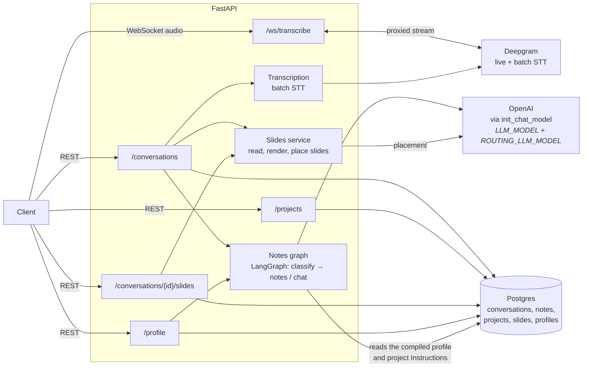
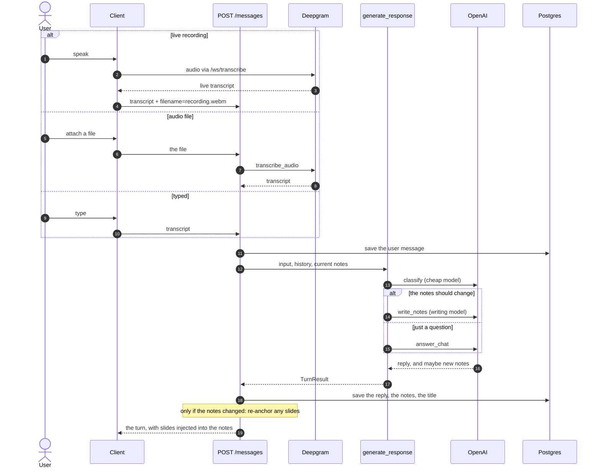

# How Veda fits together

The overview: what the pieces are, how a request travels through them, and where each
kind of state lives. It is deliberately short. The detailed flows — with the real files and
functions named, so a diagram can be traced straight into the code — live in one page per
feature; the [feature map](#3-feature-map) below links to each.

- [1. System overview](#1-system-overview)
- [2. One turn, end to end](#2-one-turn-end-to-end)
- [3. Feature map](#3-feature-map)
- [4. Where state lives](#4-where-state-lives)

---

## 1. System overview

```mermaid
flowchart LR
  CL["Client"]

  subgraph Server["FastAPI"]
    CONV["/conversations"]
    PRJ["/projects"]
    SL["/conversations/{id}/slides"]
    PR["/profile"]
    WS["/ws/transcribe"]
    GRAPH["Notes graph<br/>LangGraph: classify → notes / chat"]
    SVC["Slides service<br/>read, render, place slides"]
    TR["Transcription<br/>batch STT"]
  end

  DB[("Postgres<br/>conversations, notes,<br/>projects, slides, profiles")]
  DG["Deepgram<br/>live + batch STT"]
  LLM["OpenAI<br/>via init_chat_model<br/><i>LLM_MODEL + ROUTING_LLM_MODEL</i>"]

  CL -->|REST| CONV
  CL -->|REST| PRJ
  CL -->|REST| SL
  CL -->|REST| PR
  CL -->|WebSocket audio| WS
  WS <-->|proxied stream| DG
  CONV --> TR --> DG
  CONV --> GRAPH --> LLM
  CONV --> SVC
  SL --> SVC
  SVC -->|placement| LLM
  PR --> GRAPH
  CONV --> DB
  PRJ --> DB
  SL --> DB
  PR --> DB
  GRAPH -->|"reads the compiled profile<br/>and project Instructions"| DB
```

The Deepgram API key never reaches the client: `/ws/transcribe` proxies the live stream
server-side.

---

## 2. One turn, end to end

The path every input takes, whatever form it started in. Each step is expanded in the page
named beside it.

```mermaid
sequenceDiagram
  autonumber
  actor U as User
  participant CL as Client
  participant API as POST /messages
  participant STT as Deepgram
  participant G as generate_response
  participant LLM as OpenAI
  participant DB as Postgres

  alt live recording
    U->>CL: speak
    CL->>STT: audio via /ws/transcribe
    STT-->>CL: live transcript
    CL->>API: transcript + filename=recording.webm
  else audio file
    U->>CL: attach a file
    CL->>API: the file
    API->>STT: transcribe_audio
    STT-->>API: transcript
  else typed
    U->>CL: type
    CL->>API: transcript
  end
  API->>DB: save the user message
  API->>G: input, history, current notes
  G->>LLM: classify (cheap model)
  alt the notes should change
    G->>LLM: write_notes (writing model)
  else just a question
    G->>LLM: answer_chat
  end
  LLM-->>G: reply, and maybe new notes
  G-->>API: TurnResult
  API->>DB: save the reply, the notes, the title
  Note over API: only if the notes changed: re-anchor any slides
  API-->>CL: the turn, with slides injected into the notes
```

The model never hears audio — only the transcript text. Recording and uploading:
[Transcription](docs/transcription/README.md). The turn itself and why a failure is safe:
[Conversations](docs/conversations/README.md). The two-step model call:
[Notes generation](docs/notes-generation/README.md). Slides re-anchoring:
[Slides](docs/slides/README.md).

---

## 3. Feature map

| Feature | The flow in a line | Detail |
| --- | --- | --- |
| Conversations | A turn saves your message first and removes it again if generation fails; the notes change only when the router says so | [docs/conversations](docs/conversations/README.md) |
| Transcription | audio chunks → `/ws/transcribe` → Deepgram → a live transcript; or a file → `transcribe_audio` | [docs/transcription](docs/transcription/README.md) |
| Notes generation | `classify → write_notes \| answer_chat`; the router cannot write notes and never sees personalization | [docs/notes-generation](docs/notes-generation/README.md) |
| Personal profile | Answers are committed, then compiled into a private description; Instructions go through verbatim | [docs/profile](docs/profile/README.md) |
| Projects | A folder of conversations whose Instructions reach the writer; deleting one cascades | [docs/projects](docs/projects/README.md) |
| Slides | Keep the whole PDF; tick pages; only the difference is rendered and placed; unplaced slides stay hidden | [docs/slides](docs/slides/README.md) |

---

## 4. Where state lives

Knowing where a piece of state lives is most of knowing where a bug can be.

| State | Lives in | Survives a reload? |
| --- | --- | --- |
| Conversations, messages, notes | Postgres | yes |
| The autosaved draft transcript | Postgres | yes |
| Kept slide decks and their pages | Postgres | yes |
| The profile, projects | Postgres | yes |

Nothing is stored about the audio itself: only the transcript and a filename.
