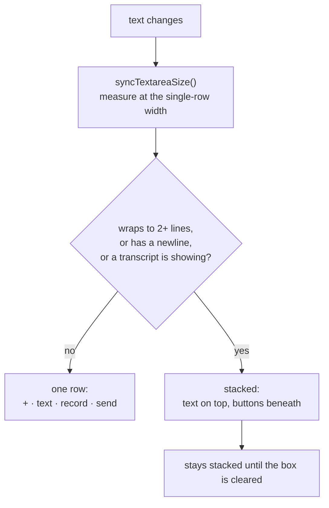
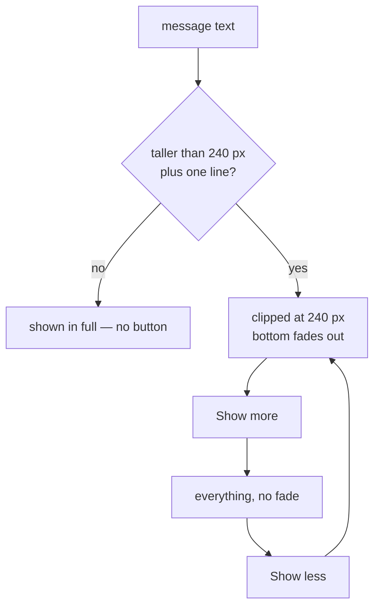
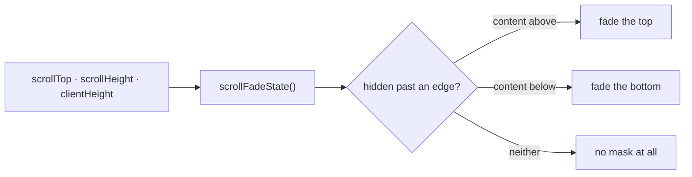

# Chat interface

## What it does

The conversation you type and speak into, and read replies in.

- **The composer** at the bottom: a **+** menu (upload an audio file, or upload/manage
  slides), a text box, a record button with a source menu (microphone or computer audio),
  and send. It grows with what you type, and switches from one row to two once the text
  wraps.
- **Your messages** as light-grey boxes. A long message collapses to about ten lines with a
  fade and a **Show more** button inside the box. An uploaded audio file is *one* box: the
  filename on top, and the transcript underneath once you open it.
- **The AI's replies** as plain full-width prose in the heading typeface — not a bubble —
  revealed progressively so they feel like a live model.
- **Soft fades** wherever text is clipped: the bottom of a collapsed message, the edges of
  the composer's text box, and the bottom of the thread where messages slide under the
  composer.

## Where the code lives

| File | Role |
| --- | --- |
| `client/src/components/chat-composer.tsx` | The composer: sizing, the two menus, attaching, recording controls, sending |
| `client/src/components/message-bubble.tsx` | `MessageBox`, `CollapsibleText`, `FileAttachmentBubble`, and the assistant's prose |
| `client/src/lib/fade.ts` | `fadeMask()`, `scrollFadeState()` and the `useScrollFade` hook |
| `client/src/lib/use-stream-reveal.ts` | The progressive reveal of a reply |
| `client/src/components/generating-indicator.tsx` | "Generating…" while the reply is on its way |
| `client/src/routes/c.$conversationId.tsx` | The thread, and the fade over its bottom edge |
| `client/src/index.css` | The `--message` colour and the typefaces |

## Flows

### The composer's layout



It decides by measuring the text at the *narrow* (single-row) width every time, never the
current width. Measuring at the wide width let long lines fit on one row, which unstacked
the layout, which made them wrap again — a flicker loop. Once stacked it stays stacked until
the field is emptied. The text box grows to 200 px and then scrolls.

### The "+" and record menus

Both are **hover menus**: opening on hover or click, closing after a short delay so moving
the pointer from the button into the menu does not flicker it shut. They are portaled to
`document.body` so the chat column's `overflow: hidden` cannot clip them, which also means
hover has to be tracked in JavaScript rather than CSS — one shared hook (`useHoverMenu`)
does that for both.

| Menu | Items |
| --- | --- |
| **+** | *Upload audio file*; then *Upload slides* (disabled until the conversation has notes) — or, once a PDF is kept, *Manage slides* instead. Never both. |
| Record | *Microphone*, *Computer audio* |

### A long message



The measurement is `scrollHeight` on the text itself, which is the full height whether or
not it is clipped, and it re-runs on resize because wrapping changes with width — opening
the notes panel can turn a short message into a long one. It only collapses if at least a
line would be hidden, so a message a few pixels over the limit is not collapsed to hide
nothing.

### The fade

Done with a CSS **mask on the clipping element's content**, not an overlay gradient. A
mask needs no knowledge of the background colour, so it works over the light message box
and the white composer alike. In a message box it is applied to an *inner* element, so the
box's own background and rounded corners stay whole and only the text fades.



The same primitive serves three places: a collapsed message (bottom), the composer's text
box and transcript area (top and bottom as they scroll), and the thread (bottom only —
top is left alone, and it is dropped when you are at the newest message so the latest text
is never dimmed). `useScrollFade` re-measures after every render, because typing changes
the scroll height without changing the box's size.

## Data and API

There is no server involvement beyond sending a message (see
[Conversations](../conversations/README.md) and [Transcription](../transcription/README.md)).
The constants that shape the behavior:

| Constant | Where | Value |
| --- | --- | --- |
| Collapsed message height | `message-bubble.tsx` | 240 px (about ten lines) |
| Hidden-line threshold | same | one line (24 px) |
| Composer text box height | `chat-composer.tsx` | grows to 200 px, then scrolls |
| Fade height | `lib/fade.ts` | 40 px |
| Reveal pace | `use-stream-reveal.ts` | about 35 characters a second, capped at 4 seconds total |

## Design decisions

- **The AI's reply is not a bubble.** It is plain prose so notes and answers read like
  content on a page, not like a chat widget. Only *your* messages sit in boxes.
- **One box for an uploaded file.** A file chip with a second box hanging off it looked like
  two messages; now the filename and its transcript are one message.
- **No borders on messages.** The grey (`--message`) is defined once in `index.css`.
- **The placeholder never wraps.** An empty text box is `nowrap`, so "Type or record…" runs
  off the edge when the composer is narrow instead of dropping to a second line; it switches
  back to normal wrapping as soon as there is text.
- **The fade is dropped at the newest message**, and elsewhere only while text is actually
  hidden, so a short message is never faded.
- **Menus are portaled**, and their hover is JavaScript — the only way to escape an ancestor's
  `overflow: hidden`.

## Tests

The pure fade logic is unit tested; everything visible is tested in a real browser by
measuring what the page actually does — computed styles, element heights, and the mask
itself.

<!--snip: client/e2e/messages.spec.ts | test("a long message collapses with a fade, and Show more / Show less toggles it" | auto -->
```ts
test("a long message collapses with a fade, and Show more / Show less toggles it", async ({ page }) => {
  await send(page, LONG)
  const text = page.getByText("Line 01 of a very long lecture message")

  // Collapsed: capped, faded, with a button.
  await expect(page.getByRole("button", { name: "Show more" })).toBeVisible()
  await expect.poll(() => height(text)).toBeLessThanOrEqual(COLLAPSED_MAX + 1)
  await expect.poll(() => mask(text)).not.toBe("none")

  // Expanded: everything, no fade.
  await page.getByRole("button", { name: "Show more" }).click()
  await expect(page.getByRole("button", { name: "Show less" })).toHaveAttribute("aria-expanded", "true")
  await expect.poll(() => height(text)).toBeGreaterThan(COLLAPSED_MAX * 2)
  await expect.poll(() => mask(text)).toBe("none")

  // And back.
  await page.getByRole("button", { name: "Show less" }).click()
  await expect(page.getByRole("button", { name: "Show more" })).toBeVisible()
  await expect.poll(() => height(text)).toBeLessThanOrEqual(COLLAPSED_MAX + 1)
})
```

<!--snip: client/src/lib/fade.test.ts | it("ignores sub-pixel remainders from fractional scroll positions" | auto -->
```ts
it("ignores sub-pixel remainders from fractional scroll positions", () => {
  // 0.4px short of the bottom is the bottom, as far as anyone can see.
  expect(scrollFadeState(299.6, 500, 200)).toEqual({ top: true, bottom: false })
  // ...and 0.4px scrolled is still the top.
  expect(scrollFadeState(0.4, 500, 200)).toEqual({ top: false, bottom: true })
})
```

| Group | File | What it proves |
| --- | --- | --- |
| `scrollFadeState` | `client/src/lib/fade.test.ts` | No fade when everything fits; bottom only at the top of overflowing content; both edges in the middle; top only at the bottom; fractional scroll positions and sub-pixel overflow are ignored |
| `fadeMask` | same | No style at all when nothing is hidden; the gradient for bottom, top or both edges; the WebKit-prefixed property is set too |
| "Long messages" | `client/e2e/messages.spec.ts` | A short message is left alone; a long one collapses with a fade and Show more / Show less toggles it; the box keeps its own background while only the text is masked; a long uploaded-audio transcript collapses the same way |
| "The chat composer" | same | Overflowing text fades, and the fade changes as it scrolls (top, middle, bottom) and clears with the text |
| "Chat styling" | same | The AI's text uses the heading font at regular weight; messages have no border and share one grey; the thread fades into the composer only while there is more below; an uploaded file and its transcript are one box; the placeholder stays on one line when the composer is narrow |
| "Error messages" | `client/e2e/messages.spec.ts` | A failed send shows a plain sentence in the composer: a server crash, a proxy's HTML error page and a validation error never show a status code, markup or `[object Object]`; a message the server wrote for people is shown as written; being offline says so without the browser's own wording |
| the "+" menu | `client/e2e/slides.spec.ts` | It offers *Upload audio file* and *Upload slides* and each opens its chooser; it becomes *Manage slides* once a PDF is kept, with no count |
| composer on small screens | `client/e2e/responsive.spec.ts` | At 320, 360 and 390 px wide, add, record and send are all on screen, the box is one row, and the placeholder is readable |

```bash
cd client && npx vitest run src/lib/fade.test.ts
cd client && npx playwright test messages.spec.ts        # needs the test stack
```

**Not covered**

- **The progressive reveal** (`use-stream-reveal.ts`) and the "Generating…" indicator.
- **Recording controls in the composer** — the source menu, pause and resume, the timer, the
  clear-transcript confirmation — since a headless browser has no microphone.
- **Dragging a file onto the composer**, and the composer's error banner.
- **The stacked-layout flicker guard** is checked only indirectly, by the overflow test.
