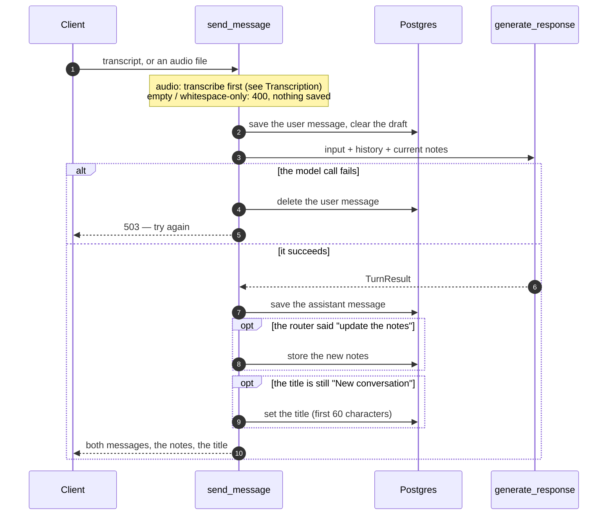
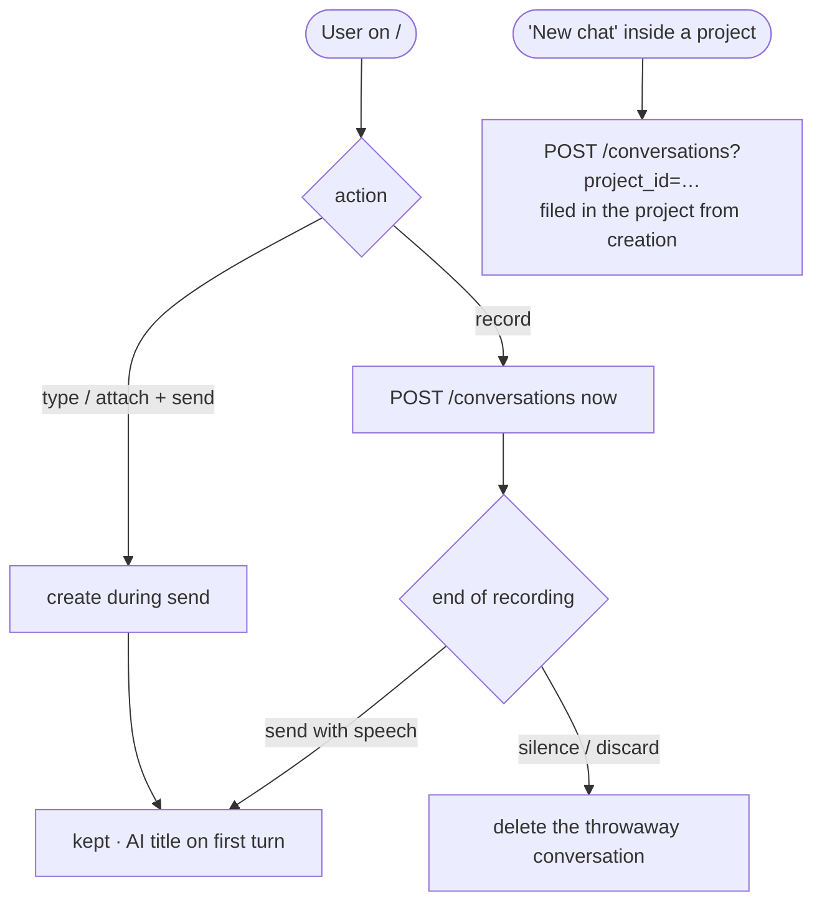

# Conversations

## What it does

A **conversation** is one lecture (or one line of study): a chat thread, plus a single
evolving notes document that the thread builds. You start one by recording, typing or
attaching audio; the AI titles it after the first turn; it appears in the sidebar; you
can come back to it later and carry on.

Two things live inside a conversation, and they are kept apart on purpose:

- **Messages** — the chat: what you said (a transcript or typed text) and the AI's short
  reply. Never the notes.
- **The notes** (`note_content`) — one Markdown document, rewritten by the model as the
  lecture goes on. See [Notes generation](../notes-generation/README.md).

A conversation can also hold [slides](../slides/README.md), and can be filed in a
[project](../projects/README.md).

## Where the code lives

| File | Role |
| --- | --- |
| `server/app/api/conversations.py` | Every conversation endpoint, including the send-message turn |
| `server/app/models/conversation.py`, `message.py` | The two tables |
| `server/app/db.py` | `init_db()`: creates tables and applies the additive `ALTER`s |
| `client/src/lib/api.ts` | The typed client for every endpoint |
| `client/src/lib/conversations-context.tsx`, `use-conversations.ts` | The sidebar's conversation list, shared across routes, with a `refetch()` |
| `client/src/routes/index.tsx` | The new-chat page (no conversation exists yet) |
| `client/src/routes/c.$conversationId.tsx` | A conversation: the thread, the header, the notes panel |
| `client/src/lib/first-send.ts` | Hands a first send that starts on `/` over to the page it navigates to |
| `client/src/components/sidebar.tsx` | The list, and deleting a conversation |

## Flows

### One turn

`POST /conversations/{id}/messages` is the heart of the app: one user input in, one
notes-and-reply out. The order of the steps is what makes a failure safe.



Three rules sit behind that diagram:

- **The user's message is saved before the model runs**, so a crash mid-generation does
  not lose what they said — and **deleted again if generation fails**, so the UI never
  shows a message that was "sent" but got no reply, and a retry does not duplicate it.
- **The notes are only overwritten when the router said so** (`notes_updated`). A
  chat-only turn returns the stored document unchanged, so the notes panel never blanks.
- **The title is set once**, on the first turn, and only while it is still the placeholder.

### Creating a conversation

Recording needs a conversation id up front (for draft autosave), so recording creates
the conversation **eagerly**. Typing or attaching creates it **lazily**, at send.



Deleting a conversation always stops any recording attached to it first.

### First send from the new-chat page

The composer on `/` creates the conversation, starts the AI request, and navigates to
`/c/{id}` while it is still running, so the header can show "New conversation" during
generation. The request has to outlive the composer, which unmounts on navigation, so it
is parked in a **module-level** variable in `first-send.ts` (not React state) and picked
up by the conversation page on mount.

## Data and API

`conversations`: `id`, `title` (default `"New conversation"`), `project_id` (nullable,
`ON DELETE CASCADE`), `note_content`, `draft_transcript`, `created_at`, `updated_at`.
`messages`: `id`, `conversation_id` (`ON DELETE CASCADE`), `role` (`user` | `assistant`),
`content`, `filename`, `created_at`.

| Endpoint | Purpose |
| --- | --- |
| `POST /conversations[?project_id=]` | Create. A `project_id` files it in that project (404 if unknown) |
| `GET /conversations` | The sidebar list, most recently updated first |
| `GET /conversations/{id}` | Messages, notes (with slides injected), `slide_count`, any autosaved draft |
| `DELETE /conversations/{id}` | Cascades to messages, slides and decks |
| `PATCH /conversations/{id}/draft` | Overwrite the autosaved transcript (204) |
| `POST /conversations/{id}/messages` | One turn (above) |

Limits: an uploaded audio file is capped at 25 MB (Deepgram's own limit); a title is cut
to 60 characters.

## Design decisions

- **The draft is overwritten, not appended.** The client always sends the whole
  transcript so far, so the server just replaces it. It is only a crash-recovery net and
  is cleared by a successful send.
- **`GET /conversations/{id}` is refetched on every visit** (`staleTime: 0`,
  `gcTime: 0`). A cached copy would carry `draft_transcript: null` from before the user
  started recording and restore the wrong thing.
- **The conversation page is remounted per conversation** (`key={conversationId}`).
  TanStack Router would otherwise reuse one instance across `/c/A → /c/B`, and a send
  still in flight would land its reply in the new conversation's view.
- **A conversation filed in a project is not in the sidebar's "Chats" list** — it is
  reached from its project, the way a file inside a folder is not also at the root.
- **There is no move-between-projects UI**, so a project can only be chosen at creation.

## Tests

The turn is where a failure loses someone's lecture, so this is the most heavily tested
path in the server. The integration tests replace only the model — everything else,
including the database and every commit, is real.

<!--snip: server/tests/integration/test_conversations_api.py | def test_generation_failure_rolls_back_the_user_message | auto -->
```python
def test_generation_failure_rolls_back_the_user_message(
    self, client: TestClient, db: Session, stub_llm
) -> None:
    # A failed turn must not leave a user message with no reply — the UI
    # would show it as sent and the retry would duplicate it.
    stub_llm(raises=RuntimeError("model exploded"))
    conversation = _make_conversation(db)

    response = client.post(f"/conversations/{conversation.id}/messages", data={"transcript": "lecture"})

    assert response.status_code == 503
    assert db.query(Message).count() == 0
```

| Group | File | What it proves |
| --- | --- | --- |
| `TestConversationLifecycle` | `integration/test_conversations_api.py` | Create returns the placeholder title; list starts empty; a missing id is 404; delete cascades to messages |
| `TestDraftAutosave` | same | A draft round-trips; each save overwrites rather than appends |
| `TestSendMessage` | same | Both turns persist; a live recording stores its filename with no audio; notes are saved only when the router says so, and a chat-only turn leaves the document alone; the first turn sets the title and later turns keep it; sending clears the draft; prior turns reach the model as history, without the current message duplicated; the conversation's project reaches `generate_response` |
| `TestSendMessageRejections` | same | An empty request and a whitespace-only transcript are rejected (400) and store nothing; an unknown conversation is 404; a failed generation rolls the user message back (503) |
| `TestStackHealth` | `system/test_stack.py` | Health reports the database; the schema was applied at startup; CORS allows the dev origin; OpenAPI is served |
| `TestConversationJourney` | same | A full turn persists across the real stack; the title is set on the first turn; a draft survives a round trip; delete removes the conversation |
| `TestErrorHandling` | same | Unknown conversation is 404; a malformed UUID is 422; an empty message and a silent recording are rejected |
| "Starting a lecture" | `e2e/notes.spec.ts` | In a browser: typing a message produces a reply and a notes document, and the conversation appears in the sidebar with a real title |

Run just these:

```bash
cd server && pytest tests/integration/test_conversations_api.py -q
cd server && pytest tests/system/test_stack.py -q                    # needs the test stack
cd client && npx playwright test notes.spec.ts -g "Starting a lecture"   # needs the test stack
```

**Not covered**

- **A known bug is pinned, not fixed.** After a failed generation the user's message is
  deleted but the autosaved draft is *not* restored, although a comment in the code
  promises it. `test_generation_failure_restores_the_draft` is marked
  `xfail(strict=True)`: it fails today, and the suite will fail if someone fixes the bug
  without updating it.
- **Sending an audio file** has no test at all — no integration, system or acceptance
  test posts a file. See [Transcription](../transcription/README.md#tests).
- **The first-send handoff** (`first-send.ts`) and the eager-create-then-delete of a
  throwaway recording conversation are covered only indirectly.
- **Deleting a conversation from the sidebar** (the confirmation, and stopping a live
  recording first) has no browser test.
