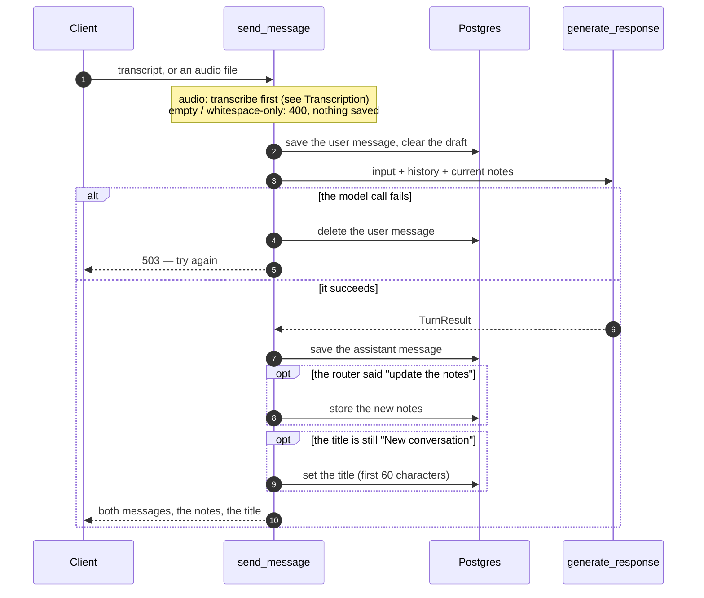
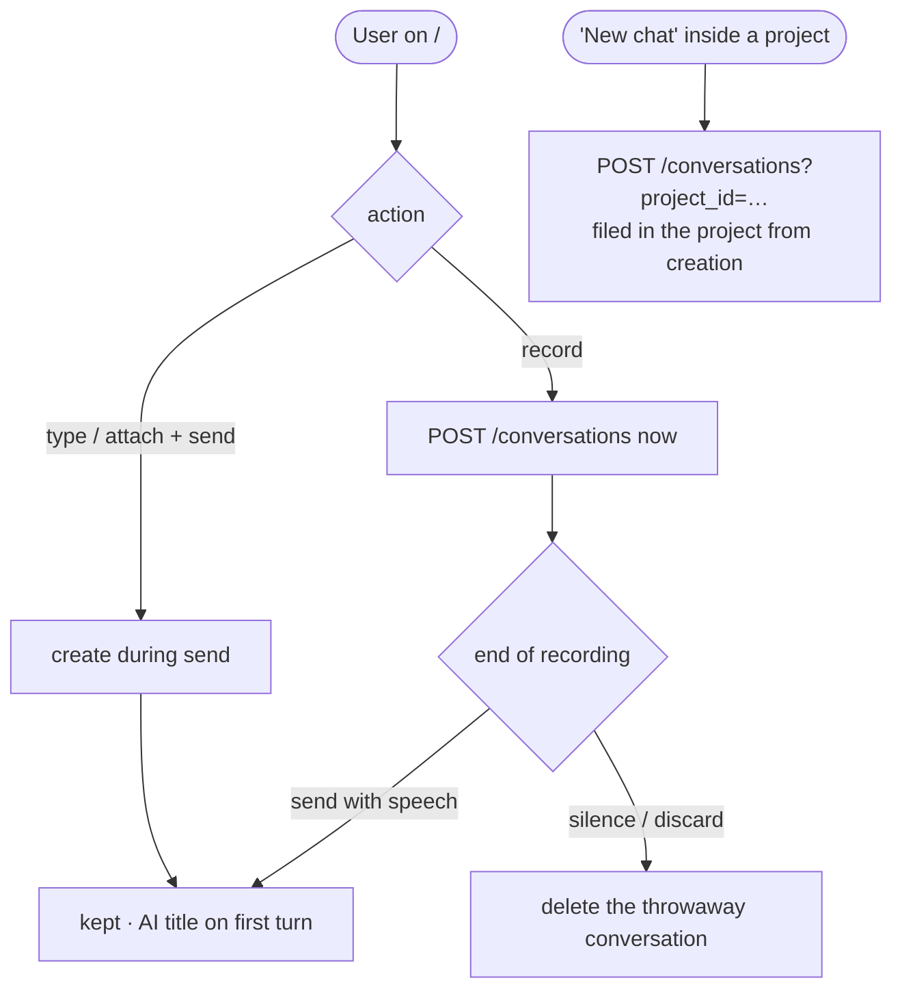

# Conversations

## What it does

A **conversation** is one lecture (or one line of study): a chat thread, plus a single
evolving notes document that the thread builds. You start one by recording, typing or
attaching audio; the AI titles it after the first turn; you
can come back to it later and carry on.

Two things live inside a conversation, and they are kept apart on purpose:

- **Messages** — the chat: what you said (a transcript or typed text) and the AI's short
  reply. Never the notes.
- **The notes** (`note_content`) — one Markdown document, rewritten by the model as the
  lecture goes on. See [Notes generation](../notes-generation/README.md).

A conversation can also hold [slides](../slides/README.md), and can be filed in a
[project](../projects/README.md).

## Flows

### One turn

`POST /conversations/{id}/messages` is the heart of the app: one user input in, one
notes-and-reply out. The order of the steps is what makes a failure safe.

```mermaid
sequenceDiagram
  autonumber
  participant C as Client
  participant API as send_message
  participant DB as Postgres
  participant G as generate_response

  C->>API: transcript, or an audio file
  Note over API: audio: transcribe first (see Transcription)<br/>empty / whitespace-only: 400, nothing saved
  API->>DB: save the user message, clear the draft
  API->>G: input + history + current notes
  alt the model call fails
    API->>DB: delete the user message
    API-->>C: 503 — try again
  else it succeeds
    G-->>API: TurnResult
    API->>DB: save the assistant message
    opt the router said "update the notes"
      API->>DB: store the new notes
    end
    opt the title is still "New conversation"
      API->>DB: set the title (first 60 characters)
    end
    API-->>C: both messages, the notes, the title
  end
```

Three rules sit behind that diagram:

- **The user's message is saved before the model runs**, so a crash mid-generation does
  not lose what they said — and **deleted again if generation fails**, so a conversation never
  shows a message that was "sent" but got no reply, and a retry does not duplicate it.
- **The notes are only overwritten when the router said so** (`notes_updated`). A
  chat-only turn returns the stored document unchanged, so the notes never blank.
- **The title is set once**, on the first turn, and only while it is still the placeholder.

### Creating a conversation

Recording needs a conversation id up front (for draft autosave), so recording creates
the conversation **eagerly**. Typing or attaching creates it **lazily**, at send.

```mermaid
flowchart TD
  START(["User on /"]) --> ACT{"action"}
  ACT -->|record| EAGER["POST /conversations now"]
  ACT -->|type / attach + send| LAZY["create during send"]
  EAGER --> OUT{"end of recording"}
  OUT -->|send with speech| KEEP["kept · AI title on first turn"]
  OUT -->|silence / discard| DEL["delete the throwaway conversation"]
  LAZY --> KEEP
  PROJ(["'New chat' inside a project"]) --> EP["POST /conversations?project_id=…<br/>filed in the project from creation"]
```

Deleting a conversation always stops any recording attached to it first.

## Design decisions

- **The draft is stored as appended chunks, not one rewritten column.** Each autosave
  sends just the newest bit of text (`PATCH .../draft/append`), stored as its own row in
  `draft_chunks` — a plain insert, cheap regardless of how long the draft already is.
  `PATCH .../draft` (full replace) exists only to clear it outright, which the client
  does by sending an empty string; `GET /conversations/{id}` reassembles the chunks,
  in order, into the `draft_transcript` string the client actually reads. It is only a
  crash-recovery net and is cleared by a successful send.
- **There is no move-between-projects operation**, so a project can only be chosen at creation.

