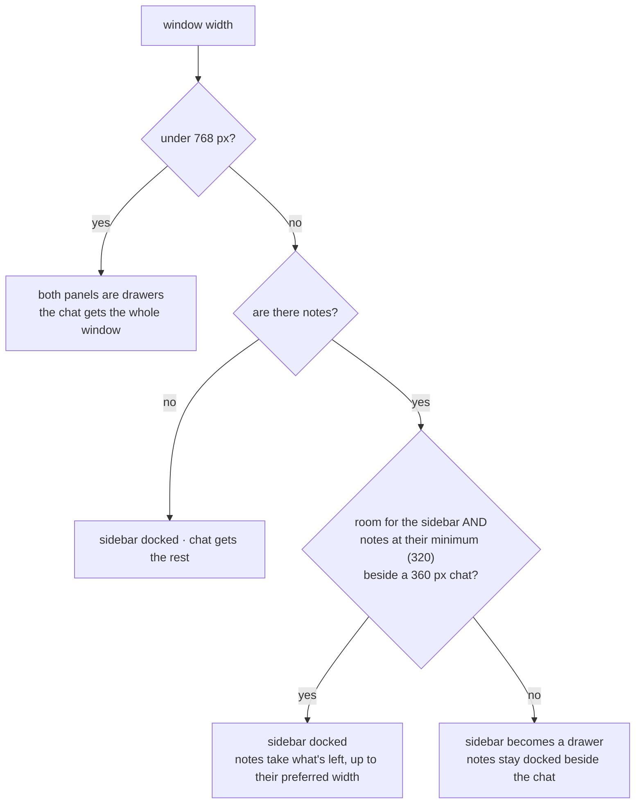
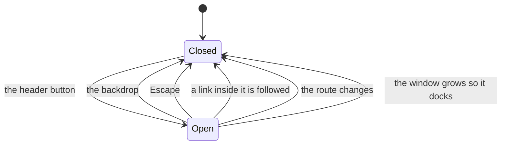

# Layout

## What it does

Decides where the **sidebar**, the **chat** and the **notes panel** go, at every window
width, so the chat is always readable. On a wide window all three sit side by side. As the
window narrows, panels give way — first by shrinking, then by becoming **drawers** that slide
over the chat instead of taking width from it.

The rule behind it: **the chat never drops below 360 px** (at 768 px and up), and under
768 px it gets the whole window.

## Where the code lives

| File | Role |
| --- | --- |
| `client/src/lib/layout-math.ts` | `computeLayout()`: pure arithmetic — given the window width and the panels' state, which panels are docked or drawers, and how wide each is |
| `client/src/lib/layout-context.tsx` | Tracks the window width and the drawers' open state; owns the panel preferences (collapsed rails, dragged notes width) |
| `client/src/components/sidebar.tsx` | Docked column, collapsed rail, or drawer |
| `client/src/components/notes-panel.tsx` | Docked panel (resizable, collapsible) or drawer |
| `client/src/components/sidebar-toggle.tsx` | The menu and notes buttons that open the drawers |
| `client/src/routes/__root.tsx` | Mounts the provider; the content area takes whatever the sidebar leaves |

## Flows

### Which panels are docked

The decision is a pure function of a few inputs, so it can be tested exhaustively and
never flickers.



The notes **shrink first**. The sidebar only gives way once the notes cannot shrink any
further. The notes themselves never become a drawer at 768 px and up: once the sidebar has
stepped aside, 768 − 360 leaves them at least 320.

### What that means as the window narrows

Both panels open, the sidebar at full width, the notes at their default 420 px:

| Window width | Sidebar | Notes | Chat |
| --- | --- | --- | --- |
| 1036 px and up | docked, 256 px | 420 px (or your dragged width) | 360 px or more |
| 936 – 1035 px | docked, 256 px | shrinking from 420 down to 320 | exactly 360 px |
| 768 – 935 px | **drawer** (menu button appears) | docked, up to your preferred width | 360 px or more |
| under 768 px | **drawer** | **drawer** (notes button appears) | the whole window |

Without notes there is nothing to make room for, so the sidebar stays docked down to 768 px.

### A drawer



A drawer slides in over the chat with a dimmed backdrop. Only one is ever open — opening
one closes the other. A closed drawer is `inert`, so keyboard focus and screen readers
cannot reach it off-screen; an open one is a modal dialog. Drawers always start closed and
their state is never remembered: a phone should open on the chat, not on a panel left open
last time.

The sidebar's menu button shows a small pulsing red dot while a recording is running, since
with the drawer closed the sidebar's recording widget is off-screen.

### The notes panel's width

Beside the chat you can drag the notes' left edge, or collapse it to a narrow rail. Both are
remembered. The width you drag to is a **preference**; the width actually used is whatever
the rule allows at the current window size. So shrinking the window squeezes the notes
without forgetting what you chose, and it comes back when the window grows.

**There is no maximum width** — the notes can grow until the chat reaches 360 px, and no
further. The drag simply stops there; it never moves the sidebar out of the way.

## Data and API

No server involvement. Preferences are kept in `localStorage`:

| Key | Holds |
| --- | --- |
| `sidebar-collapsed` | The sidebar's slim rail (56 px) |
| `notes-panel-collapsed` | The notes' slim rail (48 px) |
| `notes-panel-width` | The width you dragged the notes to |

| Constant | Value |
| --- | --- |
| Drawer breakpoint | 768 px |
| Chat minimum | 360 px |
| Sidebar | 256 px, or a 56 px rail |
| Notes | 320 px minimum, 420 px default, no maximum; or a 48 px rail |
| Drawer widths | sidebar up to 20 rem, notes up to 28 rem, each capped at 85–92 % of the window |

## Design decisions

- **Computed, not measured.** The chat's width follows from the window width and the panel
  widths, so it is calculated. Measuring it off the page would feed back on itself: docking
  a panel narrows the chat, which would flip the panel to a drawer, which widens the chat,
  and so on.
- **Shrink before hiding.** Squeezing the notes a little is less disruptive than moving the
  sidebar into a drawer, so it is tried first.
- **Not a bigger breakpoint.** Raising the drawer breakpoint to about 1000 px would also fix
  the squeeze, but it would put a desktop-sized window into the phone layout. The adaptive
  rule fixes the problem only where it occurs.
- **Preferences live in the layout context.** The sidebar has to know what the notes are
  doing, and vice versa; keeping each panel's state private made that impossible.
- **The width follows the window without animating.** The notes slide only when first
  opened and when collapsed or expanded. Animating the width while the window is dragged
  made the panel lag behind it.
- **Notes appearing can move the sidebar.** On a window around 800 px the sidebar is docked
  while there are no notes; the moment notes exist it becomes a drawer to make room. The
  change is instant.

## Tests

The arithmetic is tested exhaustively without a browser; the browser tests then check the
real page does what the arithmetic says, by sweeping the window width and measuring.

<!--snip: client/src/lib/layout-math.test.ts | it("shrinks the notes before it touches the sidebar" | auto -->
```ts
it("shrinks the notes before it touches the sidebar", () => {
  const l = at(1000)
  expect(l.sidebarDrawer).toBe(false)
  expect(l.notesWidth).toBe(1000 - SIDEBAR_FULL - MIN_CHAT) // 384
  expect(l.chatWidth).toBe(MIN_CHAT)
  // ...continuing down to the notes' own minimum.
  expect(at(936)).toMatchObject({ sidebarDrawer: false, notesWidth: NOTES_MIN, chatWidth: MIN_CHAT })
})
```

And in the browser, the same rule, checked at every width down and back up:

<!--snip: client/e2e/responsive.spec.ts | test("the chat never gets narrower than 360px, sweeping the width down and back up" | auto -->
```ts
test("the chat never gets narrower than 360px, sweeping the width down and back up", async ({ page, request }) => {
  const id = await conversationWithNotes(request)
  await page.setViewportSize({ width: 1600, height: 800 })
  await page.goto(`/c/${id}`)
  await expect(page.getByRole("complementary", { name: "Notes" })).toBeVisible()

  const down = [1600, 1440, 1200, 1100, 1036, 1000, 936, 935, 900, 850, 800, 768]
  for (const width of [...down, ...[...down].reverse()]) {
    await settle(page, width)
    const label = `at ${width}px`

    // Never a squeeze, never a sideways scroll.
    expect((await box(chat(page))).width, label).toBeGreaterThanOrEqual(MIN_CHAT - 1)
    expect(await page.evaluate(() => document.documentElement.scrollWidth <= window.innerWidth), label).toBe(true)

    // The sidebar is docked or a drawer exactly as the rule says...
    const docked = sidebarDockedAt(width)
    await expect(page.getByRole("button", { name: "Open sidebar" }), label).toHaveCount(docked ? 0 : 1)
    // ...the notes always stay beside the chat, at the width the rule says.
    const notesBox = await box(page.getByRole("complementary", { name: "Notes" }))
    expect(notesBox.width, label).toBeGreaterThanOrEqual(319)
    expect(Math.abs(notesBox.width - notesWidthAt(width)), label).toBeLessThanOrEqual(1)
  }
})
```

| Group | File | What it proves |
| --- | --- | --- |
| `under the breakpoint`, `at the breakpoint and above` | `client/src/lib/layout-math.test.ts` | Both panels are drawers under 768 px; from 768 the chat is never under 360 whatever the panels prefer; the notes never become a drawer and never fall under their minimum; the widths add up to the window |
| `the squeeze zone, with notes open` | same | The notes shrink before the sidebar moves; the sidebar becomes a drawer only once they cannot shrink further; at 768 px the chat gets exactly 360 (it used to get 92) |
| `no flapping` | same | Growing the window never flips a docked sidebar back to a drawer; the result is the same resizing either way |
| `panels the user has collapsed` | same | A collapsed sidebar rail leaves room to stay docked; a collapsed notes rail docks everything; no notes means no notes panel |
| `the drag limit` | same | The widest the notes can go is exactly what keeps the chat at 360; there is no fixed ceiling; an over-wide preference is squeezed, not honoured at the chat's expense |
| "Small screens (under 768px)" | `client/e2e/responsive.spec.ts` | The chat gets the whole width and both panels start closed and off-screen; each drawer opens over the chat without squeezing it and closes by backdrop, Escape or its button; following a link closes the sidebar; the notes never open by themselves; only one drawer is open at a time; the menu button is on the new-chat and project pages; the composer fits at 320, 360 and 390 px |
| "The breakpoint" | same | At 768 px with notes the sidebar is a drawer and the notes are docked; with no notes the sidebar stays docked; at 767 px both are drawers; growing to desktop closes an open drawer and does not bring it back when shrinking again |
| "Adaptive layout (768px and up)" | same | The sweep above; the sidebar drawer works in the mid band; growing past the threshold docks it; dragging the notes wide stops at the chat's minimum and the preference survives a smaller window; collapsed rails are honoured; the notes have no fixed maximum width |
| "The notes panel" | `client/e2e/notes.spec.ts` | The notes' collapsed state survives a reload |

```bash
cd client && npx vitest run src/lib/layout-math.test.ts
cd client && npx playwright test responsive.spec.ts        # needs the test stack
```

**Not covered**

- **Touch and swipe.** Drawers open by button, backdrop, Escape and links only; there is no
  swipe gesture and nothing tests touch input.
- **The recording dot** on the menu button: a headless browser cannot start a recording.
- **Real devices.** All the browser tests use a resized desktop Chromium; nothing runs on a
  phone, so safe-area padding and the mobile address bar are unchecked.
- **Focus management inside a drawer.** `inert` is asserted; where keyboard focus lands when a
  drawer opens or closes is not.
