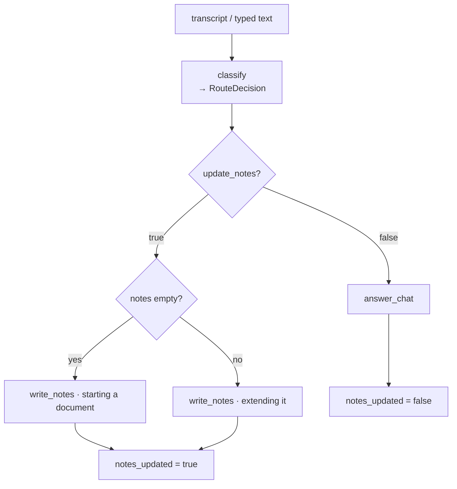
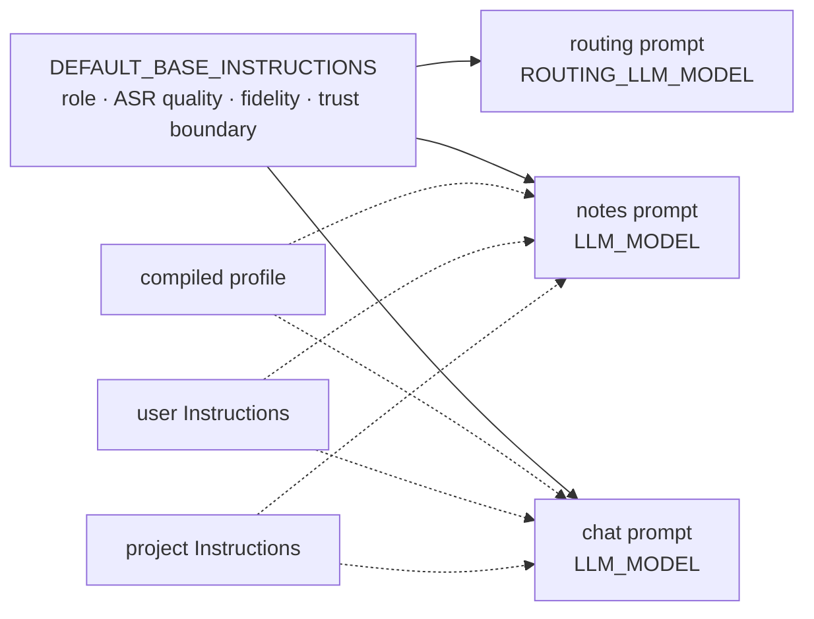

# Notes generation

## What it does

Every time you send something — a transcript, a typed message, an uploaded file's
transcript — the AI decides **whether it should change the notes**, and then either
rewrites the document or just answers in the chat.

The notes are one Markdown document per conversation, kept up to date as the lecture
goes on. New material is folded into the existing structure rather than appended; it is
not a transcript and not a chat log. A question like "what does eigenvector mean?" is
answered in the chat and leaves the document exactly as it was.

## Where the code lives

| File | Role |
| --- | --- |
| `server/app/services/notes_graph.py` | Everything: every prompt, the LangGraph state machine, `generate_response()`, model resolution, the profile compiler |
| `server/app/api/conversations.py` | Calls `generate_response()` and saves what comes back — see [Conversations](../conversations/README.md) |
| `server/app/config.py` | `LLM_MODEL`, `ROUTING_LLM_MODEL`, `OPENAI_API_KEY` |
| `server/tests/system/llm_stub.py` | The fake model the system and acceptance tests run against |

## Flows

### A turn is two steps

The graph is `classify → (write_notes | answer_chat)`.



**Why two calls.** The router's output schema has **no `note_content` field**, so it
*cannot* rewrite the document — it can only say yes or no. A single call asked to
"return the full notes" almost always returned them: filler like `thanks` used to trash
the document. The router runs on a cheap model (`ROUTING_LLM_MODEL`); only a "yes" pays
for the writing model (`LLM_MODEL`).

`conversations.py` saves the notes only when `notes_updated` is true, so a chat-only turn
leaves the stored document untouched.

### What each prompt is made of



The **router gets none of the personalization** — whether an input deserves a note change
has nothing to do with who the user is, and user-authored text must never reach the node
that decides whether the document is rewritten. The writer and the chat reply both get:

- the **compiled profile** — a private third-person description of the reader (see
  [Personal profile](../profile/README.md)), with a guard telling the model never to
  mention it in the notes;
- the user's **Instructions**, word for word, with a guard: a *preference* about style,
  depth and length that cannot override the fidelity rules or the output fields;
- the **project's Instructions** (see [Projects](../projects/README.md)), with the same
  guard, and a statement that where it conflicts with the user's own Instructions the
  project's wins for that conversation, being the more specific.

Instructions are pasted in verbatim rather than paraphrased because paraphrasing a
directive is how it gets softened or dropped.

### Starting a document versus extending one

They are different tasks and get different prompts. The *extend* prompt is dominated by
preservation rules ("keep headings stable, integrate, don't append") that are noise on a
blank page, and actively discourage a model from committing to a structure. So the
graph checks whether a document exists yet and picks `DEFAULT_NEW_NOTES_INSTRUCTIONS` or
`DEFAULT_NOTES_INSTRUCTIONS`.

### What the model sees of the conversation

Each node gets the prior turns as history, then one final message: the current title
(unless it is still the placeholder), the current notes — or an explicit "no notes
document exists yet" — and the new input. The current message is not repeated in the
history. The chat branch also gets the router's one-line reason as a private note.

### Around the graph

`generate_response()` reads the compiled profile and the project's Instructions **before**
building the graph, not inside a node. LangGraph runs synchronous nodes on a worker
thread, and a SQLAlchemy `Session` is not safe across threads. If the profile has answers
but no compiled text, it retries the compile once here; any failure simply means notes
are generated without personalization — a personalization problem must never fail a turn.

`_repair_latex_escapes()` runs over the notes the writer returns, fixing the LaTeX that
structured output mangles — see [Rendering](../rendering/README.md#repairing-what-models-get-wrong).

Slides are deliberately invisible to all of this: the writer never sees them, so it cannot
drop or mangle them. They are re-anchored after the notes are saved — see
[Slides](../slides/README.md).

## Data and API

The three structured outputs, each half of a contract with its prompt:

| Model | Fields | Returned by |
| --- | --- | --- |
| `RouteDecision` | `update_notes`, `reason` | `classify` |
| `NotesUpdate` | `note_content`, `chat_reply`, `title` | `write_notes` |
| `ChatReply` | `chat_reply`, `title` | `answer_chat` |

`generate_response()` returns a `TurnResult`: `note_content`, `chat_reply`, `title`,
`notes_updated`, `decision_reason`.

Configuration:

| Setting | Meaning |
| --- | --- |
| `LLM_MODEL` | `provider:model` for writing notes, chat replies and compiling the profile |
| `ROUTING_LLM_MODEL` | `provider:model` for the yes/no router — keep it cheap |
| `OPENAI_API_KEY` | The key for the `openai` provider |

Both strings go to LangChain's `init_chat_model`. **Only the `openai` provider is wired
up today**: `_PROVIDER_KEY_FIELDS` maps a provider to the settings field holding its key,
and `openai` is the only entry. Any other provider fails with a `503`. The person sees "The AI
service isn't available right now. Please try again later." — which provider, and which key is
missing, go to the server log only. Adding a provider means adding it to that map and giving
`Settings` its key field.

## Design decisions

- **The router cannot write notes.** That is a property of its schema, not a request in
  its prompt, so it holds even when the model wants to.
- **Prompts are code**, not stored data: each is half of a contract with the Pydantic model
  its node returns, so they are versioned together. The one exception is the compiled
  profile, which is generated per user and lives in the database.
- **Transcripts, notes and history are treated as data, not instructions.** A shared
  trust-boundary section in the base prompt names them as untrusted, carves out lectures
  that are *about* prompt injection (which must still be transcribed), and forbids
  disclosing the prompt. This is prompt hygiene, not hard enforcement.
- **Diagrams are opt-in.** An earlier "must include a diagram" rule produced one for nearly
  every process-shaped paragraph; the bar is now "would a textbook draw this?".
- **"No outside knowledge" is scoped.** That rule protects transcribed lecture material,
  where invented content corrupts the record. Applied to a direct request it caused a
  refusal loop, so it is scoped to the case it protects and a direct "add a section on X"
  is allowed to draw on what the model knows.

## Tests

Two facts shape how this is tested: the model's behavior is not something a test can
assert, and the integration layer replaces `generate_response` wholesale. So the tests
pin the **structure around the model** — what is in each prompt, what is kept out of the
router, and the order in which the stack calls things.

<!--snip: server/tests/unit/test_prompts.py | def test_router_never_sees_user_instructions | auto -->
```python
def test_router_never_sees_user_instructions(self) -> None:
    # The largest containment property: user-authored text must not reach
    # the node that decides whether the document is rewritten.
    assert INSTRUCTIONS not in _build_routing_prompt()
    assert "USER INSTRUCTIONS" not in _build_routing_prompt()
```

And, against the real running stack, the model stub records what it was sent:

<!--snip: server/tests/system/test_stack.py | def test_router_runs_before_the_writer | auto -->
```python
def test_router_runs_before_the_writer(self, api: httpx.Client, conversation: str, stub) -> None:
    api.post(f"/conversations/{conversation}/messages", data={"transcript": "lecture content"})
    schemas = [r["schema"] for r in stub.get("/__stub/requests").json()]
    assert schemas.index("RouteDecision") < schemas.index("NotesUpdate")
```

| Group | File | What it proves |
| --- | --- | --- |
| `TestPromptComposition` | `unit/test_prompts.py` | Starting and extending a document use different instructions; the profile is included when present and omitted entirely when empty, and always carries its guard |
| `TestUserInstructions` | same | Instructions appear word for word, alongside a profile, are omitted when empty, and carry their guard |
| `TestProjectInstructions` | same | Same, for a project's Instructions, plus that a project's wins over global ones |
| `TestTrustBoundary` | same | The trust boundary is in every prompt, names the untrusted inputs, carves out lectures about injection, and forbids disclosing the prompt |
| `TestRouterContainment` | same | The router prompt has no profile hook and never sees user or project Instructions; it is the base plus the routing rules and nothing else |
| `TestRoutingRules` | same | Routing rules: an affirmative is routed by what it agrees to, filler has a carve-out for answers, polite requests are instructions, genuine questions still go to chat, the chat branch must not re-ask |
| `TestNoteContext` | same | The note context includes the document and a real title, never offers the placeholder title for preservation, and says so when there are no notes |
| `TestHistoryMessages` | same | Roles map to the right message types, in order |
| `TestModelWiring` | `system/test_stack.py` | Both graph nodes run; the router runs before the writer; the transcript reaches the model; nothing reached a real provider |
| "Chat that must not touch the notes" | `e2e/notes.spec.ts` | In a browser, a question is answered without changing the document |

```bash
cd server && pytest tests/unit/test_prompts.py -q
cd server && pytest tests/system/test_stack.py -k ModelWiring -q          # needs the test stack
cd client && npx playwright test notes.spec.ts -g "must not touch"        # needs the test stack
```

**Not covered**

- **Whether the prompts actually work.** Every model call in the tests is a stub, so no test
  evaluates the quality of notes, the correctness of routing decisions, or how well a
  guard holds against a real model. The tests check that the guards are *present* and in
  the right places.
- **The graph in the integration layer.** Those tests patch `generate_response`, so the
  LangGraph wiring is exercised only by the system layer.
- **Model configuration.** `_resolve_llm` — the missing-key `503`, the provider map — has no
  test.
