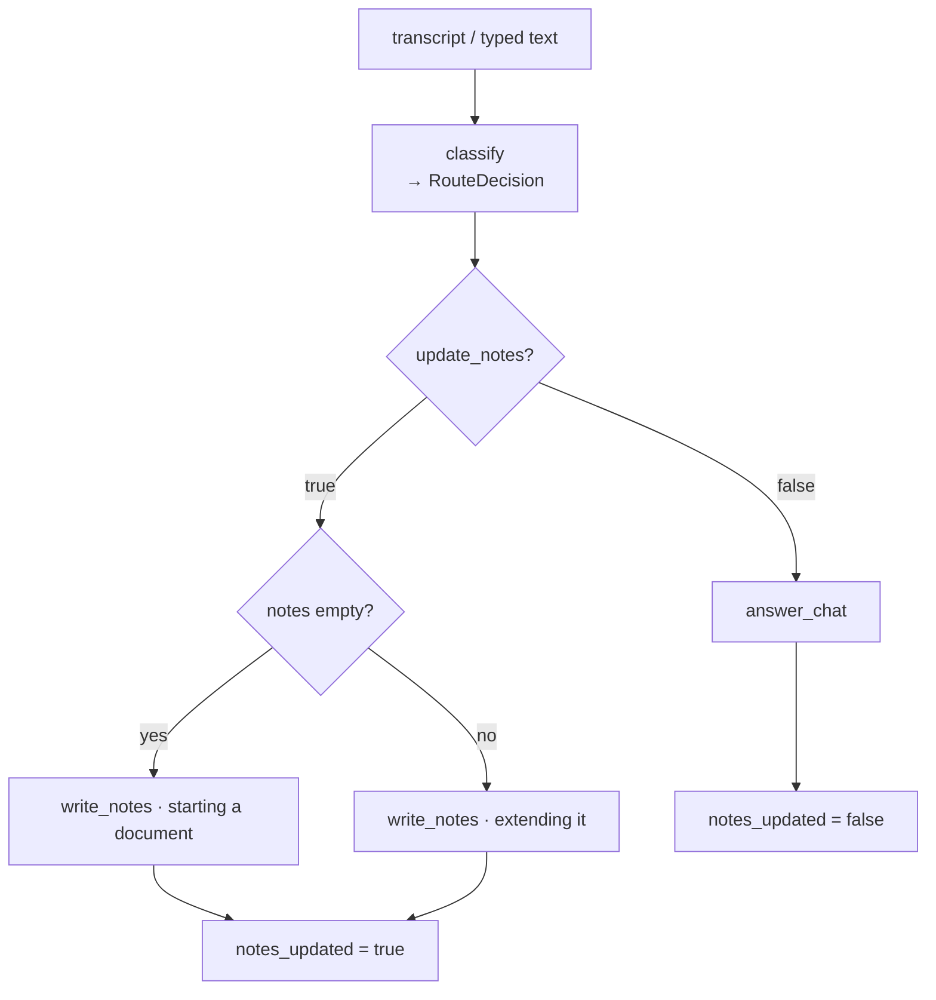
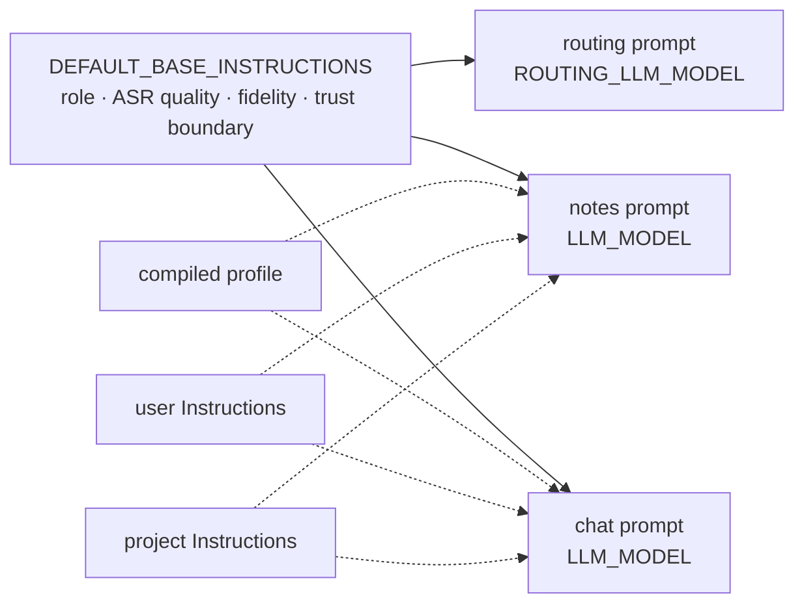

# Notes generation

## What it does

Every time you send something — a transcript, a typed message, an uploaded file's
transcript — the AI decides **whether it should change the notes**, and then either
rewrites the document or just answers in the chat.

The notes are one Markdown document per conversation, kept up to date as the lecture
goes on. New material is folded into the existing structure rather than appended; it is
not a transcript and not a chat log. A question like "what does eigenvector mean?" is
answered in the chat and leaves the document exactly as it was.

## Flows

### A turn is two steps

The graph is `classify → (write_notes | answer_chat)`.

```mermaid
flowchart TD
  IN["transcript / typed text"] --> C["classify<br/>→ RouteDecision"]
  C --> Q{"update_notes?"}
  Q -->|true| N{"notes empty?"}
  N -->|yes| WN["write_notes · starting a document"]
  N -->|no| W["write_notes · extending it"]
  Q -->|false| A["answer_chat"]
  WN --> S["notes_updated = true"]
  W --> S
  A --> U["notes_updated = false"]
```

**Why two calls.** The router's output schema has **no `note_content` field**, so it
*cannot* rewrite the document — it can only say yes or no. A single call asked to
"return the full notes" almost always returned them: filler like `thanks` used to trash
the document. The router runs on a cheap model (`ROUTING_LLM_MODEL`); only a "yes" pays
for the writing model (`LLM_MODEL`).

The server saves the notes only when `notes_updated` is true, so a chat-only turn
leaves the stored document untouched.

### What each prompt is made of

```mermaid
flowchart LR
  BASE["DEFAULT_BASE_INSTRUCTIONS<br/>role · ASR quality · fidelity · trust boundary"] --> R["routing prompt<br/>ROUTING_LLM_MODEL"]
  BASE --> N["notes prompt<br/>LLM_MODEL"]
  BASE --> C["chat prompt<br/>LLM_MODEL"]
  PROF["compiled profile"] -.-> N
  PROF -.-> C
  INST["user Instructions"] -.-> N
  INST -.-> C
  PINST["project Instructions"] -.-> N
  PINST -.-> C
```

The **router gets none of the personalization** — whether an input deserves a note change
has nothing to do with who the user is, and user-authored text must never reach the node
that decides whether the document is rewritten. The writer and the chat reply both get:

- the **compiled profile** — a private third-person description of the reader (see
  [Personal profile](../profile/README.md)), with a guard telling the model never to
  mention it in the notes;
- the user's **Instructions**, word for word, with a guard: a *preference* about style,
  depth and length that cannot override the fidelity rules or the output fields;
- the **project's Instructions** (see [Projects](../projects/README.md)), with the same
  guard, and a statement that where it conflicts with the user's own Instructions the
  project's wins for that conversation, being the more specific.

Instructions are pasted in verbatim rather than paraphrased because paraphrasing a
directive is how it gets softened or dropped.

### Starting a document versus extending one

They are different tasks and get different prompts. The *extend* prompt is dominated by
preservation rules ("keep headings stable, integrate, don't append") that are noise on a
blank page, and actively discourage a model from committing to a structure. So the
graph checks whether a document exists yet and picks `DEFAULT_NEW_NOTES_INSTRUCTIONS` or
`DEFAULT_NOTES_INSTRUCTIONS`.

### What the model sees of the conversation

Each node gets the prior turns as history, then one final message: the current title
(unless it is still the placeholder), the current notes — or an explicit "no notes
document exists yet" — and the new input. The current message is not repeated in the
history. The chat branch also gets the router's one-line reason as a private note.

### Around the graph

`generate_response()` reads the compiled profile and the project's Instructions **before**
building the graph, not inside a node. LangGraph runs synchronous nodes on a worker
thread, and a SQLAlchemy `Session` is not safe across threads. If the profile has answers
but no compiled text, it retries the compile once here; any failure simply means notes
are generated without personalization — a personalization problem must never fail a turn.

`_repair_latex_escapes()` runs over the notes the writer returns, fixing the LaTeX that
structured output mangles.

Slides are deliberately invisible to all of this: the writer never sees them, so it cannot
drop or mangle them. They are re-anchored after the notes are saved — see
[Slides](../slides/README.md).

## Design decisions

- **The router cannot write notes.** That is a property of its schema, not a request in
  its prompt, so it holds even when the model wants to.
- **Prompts are code**, not stored data: each is half of a contract with the Pydantic model
  its node returns, so they are versioned together. The one exception is the compiled
  profile, which is generated per user and lives in the database.
- **Transcripts, notes and history are treated as data, not instructions.** A shared
  trust-boundary section in the base prompt names them as untrusted, carves out lectures
  that are *about* prompt injection (which must still be transcribed), and forbids
  disclosing the prompt. This is prompt hygiene, not hard enforcement.
- **Diagrams are opt-in.** An earlier "must include a diagram" rule produced one for nearly
  every process-shaped paragraph; the bar is now "would a textbook draw this?".
- **"No outside knowledge" is scoped.** That rule protects transcribed lecture material,
  where invented content corrupts the record. Applied to a direct request it caused a
  refusal loop, so it is scoped to the case it protects and a direct "add a section on X"
  is allowed to draw on what the model knows.

