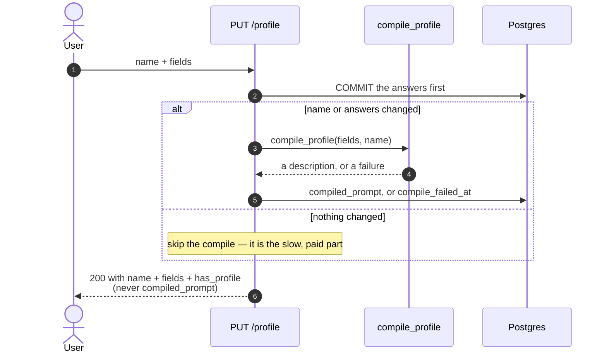
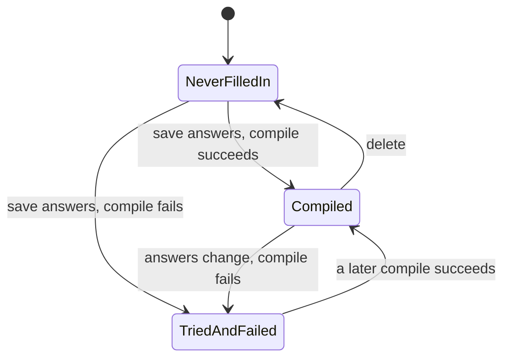

# Personal profile

## What it does

A short form — your name, what you do, your background, what you use notes for, what you
want emphasized — plus a free-text **Instructions** box. It changes how notes and chat
replies are pitched: depth, vocabulary, emphasis. It is one profile for the whole app
(there is no sign-in), reached from the profile row at the bottom of the sidebar.

Two different things reach the model from this form, and they are handled differently on
purpose:

| | Compiled description | Instructions |
| --- | --- | --- |
| Written by | an LLM, from the form answers | you |
| Visible to you | **no** | yes |
| Reaches the writer as | compiled prose | your exact words |
| If compiling fails | the personal layer is left out; notes still generate | unaffected |

## Where the code lives

| File | Role |
| --- | --- |
| `server/app/api/profile.py` | `GET`, `PUT` and `DELETE /profile`; the save-then-compile flow |
| `server/app/models/user_profile.py` | The single-row `user_profiles` table |
| `server/app/services/notes_graph.py` | `format_profile_fields()`, `compile_profile()`, the lazy retry in `_user_profile()`, `_user_instructions()` |
| `client/src/components/profile-dialog.tsx` | The form and the Instructions box |
| `client/src/components/sidebar.tsx` | The profile row: your name and occupation, or "Set up your profile" |

## Flows

### Saving

The answers are committed **before** the model is touched, so what you typed is durable
no matter what happens next. Compilation is derived text that can fail and be retried.



If answers exist but `compiled_prompt` is empty — an earlier compile failed — the next
notes turn **retries once**, then carries on without personalization rather than failing.
A personalization problem must never fail a lecture.

### Three states



`compiled_prompt` is null in both the first and third state, which is why
`compile_failed_at` exists: it separates "the user never filled this in" from "we tried and
it broke". A success always clears it.

## Data and API

`user_profiles` is a single global row: `name`, `fields` (JSONB), `compiled_prompt`
(**private**, nullable — null is the one "absent" state), `compile_failed_at`,
`updated_at`. The answers live in `fields` as JSONB because two of them are multi-select
and the form keeps changing shape.

| Endpoint | Purpose |
| --- | --- |
| `GET /profile` | `{ name, fields, has_profile }` — never `compiled_prompt` |
| `PUT /profile` | Replace the profile; recompile if the name or any answer changed |
| `DELETE /profile` | Remove it (204 even if there was nothing to remove) |

The answers: `occupation`, `background_level`, `education_level`, `notes_purpose` (a
list), `emphasize` (a list), `instructions`. Caps: name and each short answer 200
characters, Instructions 600, and the compiled description is trimmed to 700.

## Design decisions

- **The compiled description is private.** It used to be shown in an editable box, which
  needed a hand-edit endpoint, an `is_edited` column and a confirm dialog to stop a form
  change silently overwriting it. Making it private removed all of that: you control the
  answers and the Instructions, not the paraphrase of them.
- **Instructions skip the compiler.** The compiler writes a third-person biography and
  rejects imperatives, so feeding it directives would either strip them or corrupt the
  biography. They reach the writer verbatim, behind a guard that makes them a *preference*
  about style rather than a rule that can override the fidelity rules.
- **The compiler never sees the Instructions**, and the name is compiled in but the model
  is told never to address you by it in the notes (it may in chat).
- **Recompile only when something changed.** An untouched form costs nothing; a name-only
  edit still recompiles, because the name lives outside `fields` and is part of the
  comparison.
- **The legacy `extra` key** (the Instructions field's old name) is still read as
  Instructions, so profiles saved before the rename keep working.

## Tests

<!--snip: server/tests/integration/test_profile_api.py | def test_resaving_identical_answers_skips_the_compile | auto -->
```python
def test_resaving_identical_answers_skips_the_compile(self, client: TestClient, stub_compile) -> None:
    # Compilation is the slow, paid part; an untouched form must cost nothing.
    calls = stub_compile()
    client.put("/profile", json=ANSWERS)
    assert len(calls) == 1
    client.put("/profile", json=ANSWERS)
    assert len(calls) == 1, "an unchanged form triggered a second compile"
```

The integration tests stub `compile_profile` and record how many times it is called, so
"did it compile?" is directly assertable.

| Group | File | What it proves |
| --- | --- | --- |
| module-level tests | `unit/test_profile_fields.py` | `format_profile_fields`: an empty profile renders nothing; blank answers are omitted; the name and every answer survive; multi-select lists are joined; a string where a list is expected is tolerated; unknown keys are ignored; one line per answer; **Instructions (and the legacy `extra` key) never reach the compiler** |
| `TestUserInstructions` | `unit/test_prompts.py` | Instructions reach the writer word for word |
| `TestEmptyProfile` | `integration/test_profile_api.py` | `GET` with no row; `DELETE` with no row is still 204 |
| `TestSaveAndCompile` | same | Answers are saved and compiled; multi-select survives the JSONB round trip; an identical re-save skips the compile; a name-only change recompiles; answers survive a compile failure; over-long answers and Instructions are rejected |
| `TestInstructions` | same | Stored exactly as typed; round-trip through the API; the legacy `extra` key reads as Instructions |
| `TestPrivateDescription` | same | The compiled description is in neither the save nor the get response, and the old hand-edit endpoints are gone |
| `TestThreeStates` | same | Never filled in; tried and failed; a success clears a previous failure |
| `TestDelete` | same | Delete removes the row |

```bash
cd server && pytest tests/unit/test_profile_fields.py tests/integration/test_profile_api.py -q
```

**Not covered**

- **The dialog and the sidebar row** have no browser test: the form, the "Set up your
  profile" state, and the skeleton shown while it loads.
- **Compile quality.** The compile call is stubbed everywhere, so nothing checks that a real
  model produces a usable description within the length cap.
- **The lazy retry** inside `_user_profile()` (compile again on the next notes turn) is
  exercised only indirectly.
