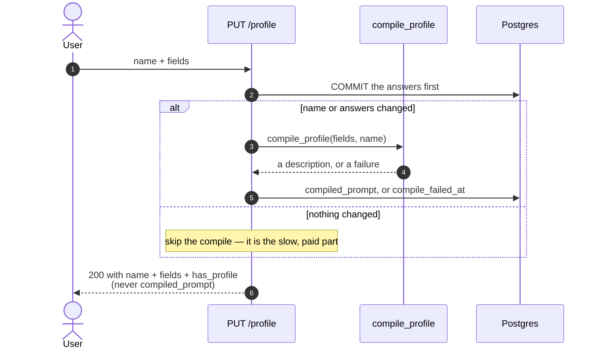
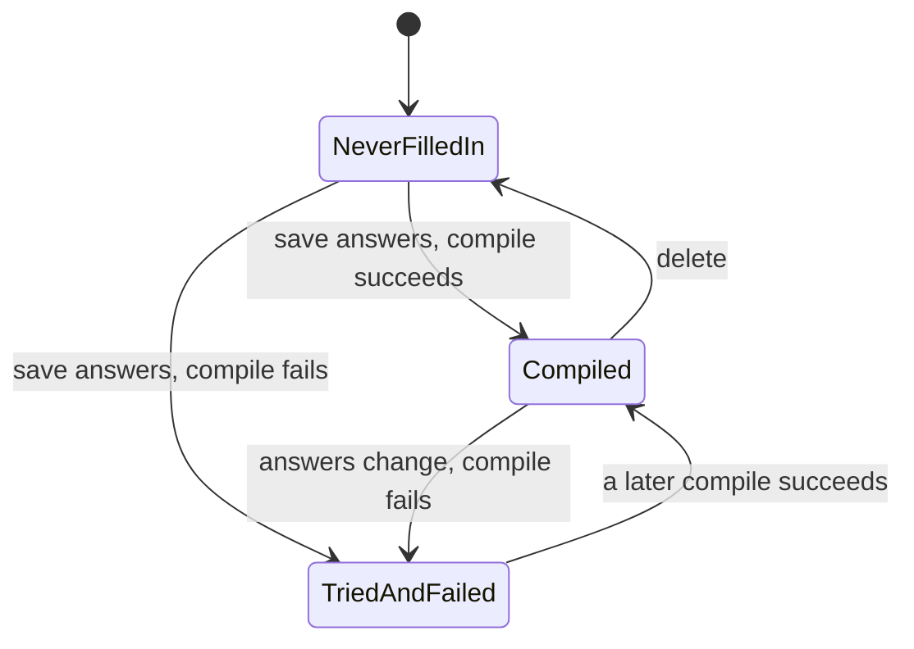

# Personal profile

## What it does

A short form — your name, what you do, your background, what you use notes for, what you
want emphasized — plus a free-text **Instructions** box. It changes how notes and chat
replies are pitched: depth, vocabulary, emphasis. It is one profile for the whole app.

Two different things reach the model from this form, and they are handled differently on
purpose:

| | Compiled description | Instructions |
| --- | --- | --- |
| Written by | an LLM, from the form answers | you |
| Visible to you | **no** | yes |
| Reaches the writer as | compiled prose | your exact words |
| If compiling fails | the personal layer is left out; notes still generate | unaffected |

## Flows

### Saving

The answers are committed **before** the model is touched, so what you typed is durable
no matter what happens next. Compilation is derived text that can fail and be retried.

```mermaid
sequenceDiagram
  autonumber
  actor U as User
  participant PR as PUT /profile
  participant G as compile_profile
  participant DB as Postgres

  U->>PR: name + fields
  PR->>DB: COMMIT the answers first
  alt name or answers changed
    PR->>G: compile_profile(fields, name)
    G-->>PR: a description, or a failure
    PR->>DB: compiled_prompt, or compile_failed_at
  else nothing changed
    Note over PR: skip the compile — it is the slow, paid part
  end
  PR-->>U: 200 with name + fields + has_profile<br/>(never compiled_prompt)
```

If answers exist but `compiled_prompt` is empty — an earlier compile failed — the next
notes turn **retries once**, then carries on without personalization rather than failing.
A personalization problem must never fail a lecture.

### Three states

```mermaid
stateDiagram-v2
  [*] --> NeverFilledIn
  NeverFilledIn --> Compiled: save answers, compile succeeds
  NeverFilledIn --> TriedAndFailed: save answers, compile fails
  TriedAndFailed --> Compiled: a later compile succeeds
  Compiled --> TriedAndFailed: answers change, compile fails
  Compiled --> NeverFilledIn: delete
```

`compiled_prompt` is null in both the first and third state, which is why
`compile_failed_at` exists: it separates "the user never filled this in" from "we tried and
it broke". A success always clears it.

## Design decisions

- **The compiled description is private.** It used to be shown in an editable box, which
  needed a hand-edit endpoint, an `is_edited` column and a confirmation step to stop a form
  change silently overwriting it. Making it private removed all of that: you control the
  answers and the Instructions, not the paraphrase of them.
- **Instructions skip the compiler.** The compiler writes a third-person biography and
  rejects imperatives, so feeding it directives would either strip them or corrupt the
  biography. They reach the writer verbatim, behind a guard that makes them a *preference*
  about style rather than a rule that can override the fidelity rules.
- **The compiler never sees the Instructions**, and the name is compiled in but the model
  is told never to address you by it in the notes (it may in chat).
- **Recompile only when something changed.** An untouched form costs nothing; a name-only
  edit still recompiles, because the name lives outside `fields` and is part of the
  comparison.
- **The legacy `extra` key** (the Instructions field's old name) is still read as
  Instructions, so profiles saved before the rename keep working.

