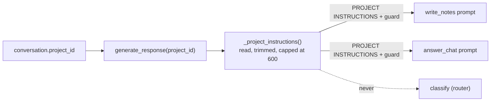
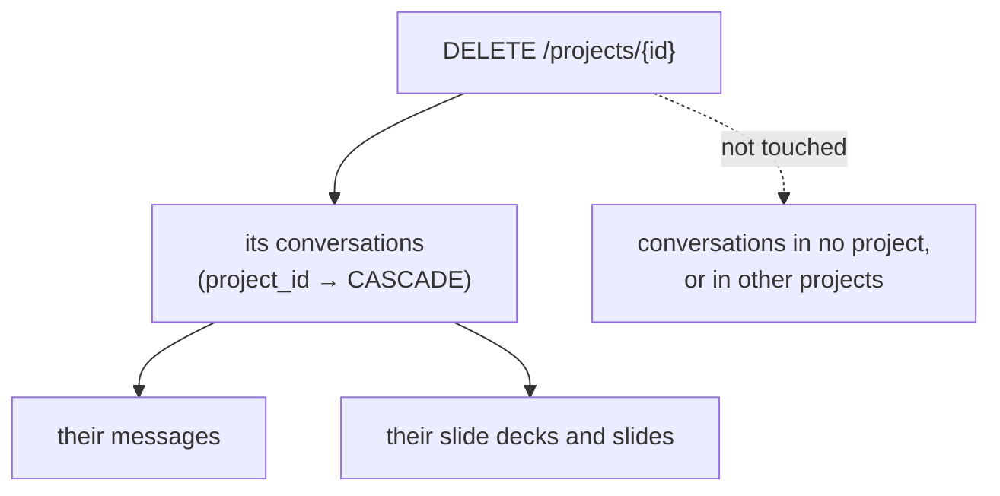

# Projects

## What it does

A **project** is a folder for related conversations — a course, a research topic, a
reading group. It is flat: a project holds conversations directly, cannot contain other
projects, and a conversation belongs to at most one.

A project has:

- a **name** and a free-text **type** ("Course", "Research" — whatever you call it; nothing
  in the app branches on it);
- a **description**, shown back to you on the project's page — descriptive only, never sent
  to the AI;
- **Instructions** — your own directions for how notes in *this* project should be written
  ("British spelling; cite the textbook chapter"). These reach the writer on every turn of
  every conversation in the project.

You create one with the **+** beside "Projects" in the sidebar. Each project appears in
the sidebar with its conversations nested beneath it, and has its own page. "New chat" on
a project's page creates a conversation already filed in it.

## Where the code lives

| File | Role |
| --- | --- |
| `server/app/api/projects.py` | CRUD, and the list with conversation counts |
| `server/app/models/project.py` | The `projects` table |
| `server/app/models/conversation.py` | `project_id`, the `ON DELETE CASCADE` foreign key |
| `server/app/services/notes_graph.py` | `_project_instructions()` and the project block in the prompts |
| `server/app/api/conversations.py` | Creating a conversation with `?project_id=`; passing the project to `generate_response` |
| `client/src/routes/p.$projectId.tsx` | A project's page |
| `client/src/components/project-form-dialog.tsx` | The create/edit form (one dialog for both) |
| `client/src/components/project-menu.tsx` | The "…" menu: Edit details, Delete project |
| `client/src/components/sidebar.tsx` | The Projects section with nested conversations |
| `client/src/lib/projects-context.tsx`, `use-projects.ts` | The shared project list, with a `refetch()` |

## Flows

### How a project changes the notes

The project's Instructions are read at the start of each turn and added to the writer and
chat prompts — never the router's.



The block is pasted in **verbatim** and wrapped in a guard saying it is a *preference*
about style, depth and length that cannot override the fidelity rules. Where it conflicts
with the user's own global Instructions, the project's wins for that conversation, being
the more specific. See [Notes generation](../notes-generation/README.md).

### Deleting a project

Deleting a project deletes **every conversation filed under it, and their notes, messages
and slides with them.** It is one statement: the foreign keys cascade, chained through
each conversation's own cascades. The client confirms with you first, since it cannot be
undone.



## Data and API

`projects`: `id`, `name` (default "New project"), `type`, `description`, `instructions`,
`created_at`, `updated_at`.

| Endpoint | Purpose |
| --- | --- |
| `POST /projects` | Create |
| `GET /projects` | The list, most recently updated first, each with `conversation_count` |
| `GET /projects/{id}` | The project plus its conversations, most recently updated first |
| `PUT /projects/{id}` | Replace name, type, description and Instructions |
| `DELETE /projects/{id}` | Delete, with the cascade above (204) |

Caps: name 200 characters, type 100, description 500, Instructions 600 — the same cap as
the profile's Instructions, and for the same reason: this text rides on every generation
call for every conversation inside the project. Unlike the profile's compiled description
there is nothing private here, so Instructions round-trip through the API.

## Design decisions

- **Flat, and no move-between-projects.** A conversation gets its project when it is
  created; there is no UI to change it afterwards.
- **"New chat" on a project's page creates eagerly.** The global "New chat" creates lazily
  on first send, but here the conversation is filed in the project from the moment it
  exists, rather than needing a second step to assign it.
- **A filed conversation is not in the sidebar's "Chats" list.** It is reached through its
  project, like a file inside a folder.
- **Description and Instructions are separate on purpose.** One is for you, one is for the
  writer; mixing them would send descriptive text to the model as if it were a directive.
- **The list is two queries** — the projects, then one grouped count — joined in Python,
  rather than a correlated subquery per row. The table is small.

## Tests

The API is tested against a real Postgres, which matters most for the cascade: deleting a
project must remove exactly the right rows and nothing else.

<!--snip: server/tests/integration/test_projects_api.py | def test_delete_cascades_to_its_conversations | auto -->
```python
def test_delete_cascades_to_its_conversations(self, client: TestClient, db: Session) -> None:
    project = _make_project(db)
    conversation = _make_conversation(db, project_id=project.id, note_content="A vector has magnitude.")
    # Captured before the delete: the row is gone once client.delete()
    # returns, and reading .id off an ORM object whose row vanished
    # underneath it — even just to build a where() clause — triggers a
    # refresh that raises ObjectDeletedError instead of the plain UUID.
    conversation_id = conversation.id

    assert client.delete(f"/projects/{project.id}").status_code == 204

    db.expire_all()
    survivor = db.execute(select(Conversation).where(Conversation.id == conversation_id)).scalar_one_or_none()
    assert survivor is None, "the conversation survived its project's deletion"
```

| Group | File | What it proves |
| --- | --- | --- |
| `TestProjectCrud` | `integration/test_projects_api.py` | Create round-trips every field; the list starts empty and is newest first; a missing project is 404; update replaces the fields; over-long Instructions are rejected |
| `TestProjectConversations` | same | A project's detail lists its conversations; creating a conversation with a project id assigns it; an unknown project id is rejected; no project id means ungrouped |
| `TestProjectDeletion` | same | Delete cascades to its conversations and to the messages inside them; conversations outside the project are left alone; deleting a missing project is 404 |
| `TestProjectInstructions` | `unit/test_prompts.py` | Project Instructions appear word for word, survive alongside the profile and user Instructions, are omitted when there is no project, carry their guard, and state that they win over global ones |
| `TestRouterContainment` | same | The router prompt never contains project Instructions |
| `TestSendMessage` | `integration/test_conversations_api.py` | The conversation's project reaches `generate_response` |
| "the new-chat page has the menu button too, and the project page" | `e2e/responsive.spec.ts` | On a phone-sized screen the project page has the sidebar's menu button |

```bash
cd server && pytest tests/integration/test_projects_api.py -q
cd server && pytest tests/unit/test_prompts.py -k "Project or Router" -q
```

**Not covered**

- **The project UI has no browser test** beyond the menu-button check: creating a project
  from the sidebar's "+", editing through the dialog, the "…" menu, the delete
  confirmation, "New chat" on a project's page, and the nested conversation list.
- **The instruction length cap is tested on the API, not on what reaches the prompt** —
  `_project_instructions()` trimming an over-long stored value is not asserted directly.
