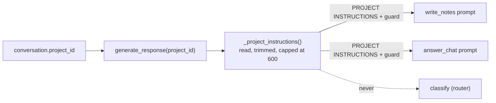
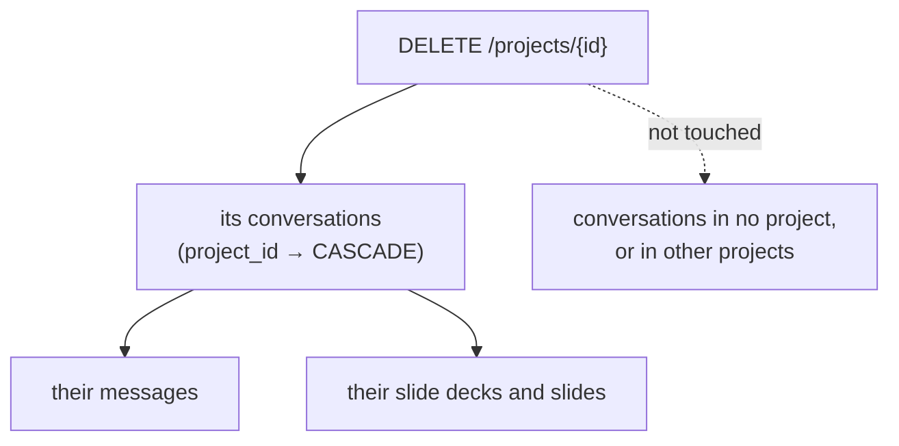

# Projects

## What it does

A **project** is a folder for related conversations — a course, a research topic, a
reading group. It is flat: a project holds conversations directly, cannot contain other
projects, and a conversation belongs to at most one.

A project has:

- a **name** and a free-text **type** ("Course", "Research" — whatever you call it; nothing
  in the app branches on it);
- a **description**, shown back to you on the project's page — descriptive only, never sent
  to the AI;
- **Instructions** — your own directions for how notes in *this* project should be written
  ("British spelling; cite the textbook chapter"). These reach the writer on every turn of
  every conversation in the project.

Each project holds its conversations, and a chat started inside a project is already
filed in it.

## Flows

### How a project changes the notes

The project's Instructions are read at the start of each turn and added to the writer and
chat prompts — never the router's.

```mermaid
flowchart LR
  CONV["conversation.project_id"] --> GR["generate_response(project_id)"]
  GR --> PI["_project_instructions()<br/>read, trimmed, capped at 600"]
  PI -->|"PROJECT INSTRUCTIONS + guard"| N["write_notes prompt"]
  PI -->|"PROJECT INSTRUCTIONS + guard"| C["answer_chat prompt"]
  PI -. never .-> R["classify (router)"]
```

The block is pasted in **verbatim** and wrapped in a guard saying it is a *preference*
about style, depth and length that cannot override the fidelity rules. Where it conflicts
with the user's own global Instructions, the project's wins for that conversation, being
the more specific. See [Notes generation](../notes-generation/README.md).

### Deleting a project

Deleting a project deletes **every conversation filed under it, and their notes, messages
and slides with them.** It is one statement: the foreign keys cascade, chained through
each conversation's own cascades. It cannot be undone.

```mermaid
flowchart TD
  P["DELETE /projects/{id}"] --> C["its conversations<br/>(project_id → CASCADE)"]
  C --> M["their messages"]
  C --> S["their slide decks and slides"]
  P -.->|not touched| O["conversations in no project,<br/>or in other projects"]
```

## Design decisions

- **Flat, and no move-between-projects.** A conversation gets its project when it is
  created; there is no way to change it afterwards.
- **"New chat" on a project's page creates eagerly.** The global "New chat" creates lazily
  on first send, but here the conversation is filed in the project from the moment it
  exists, rather than needing a second step to assign it.
- **Description and Instructions are separate on purpose.** One is for you, one is for the
  writer; mixing them would send descriptive text to the model as if it were a directive.
- **The list is two queries** — the projects, then one grouped count — joined in Python,
  rather than a correlated subquery per row. The table is small.

