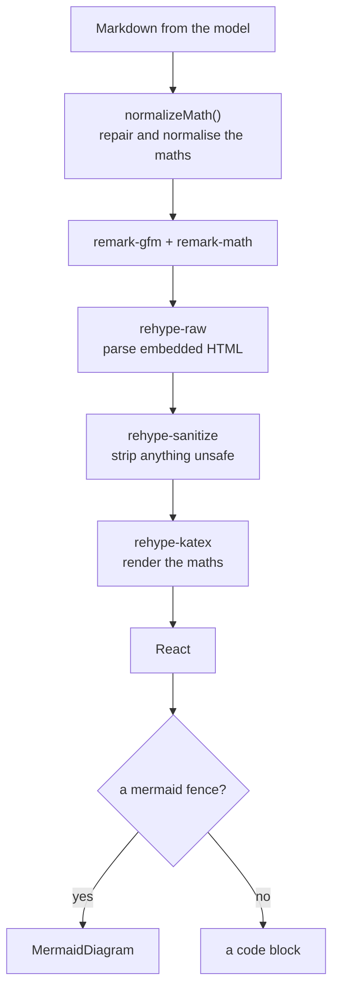
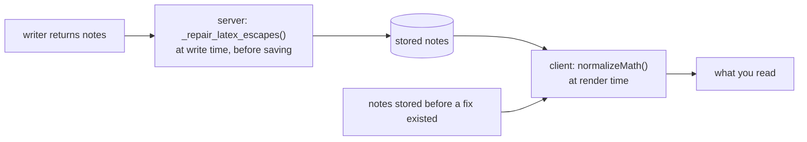
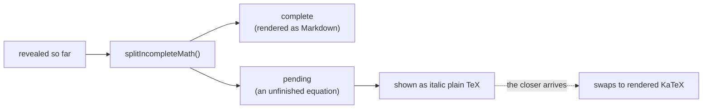

# Rendering

## What it does

Turns the Markdown a model writes into what you read, in two places that share one
component: the **notes panel** and the **assistant's chat replies**. It handles:

- ordinary Markdown, including tables and task lists (GitHub-flavoured);
- **maths**, rendered with KaTeX, including display equations and matrices;
- **Mermaid diagrams**, drawn as diagrams instead of shown as source;
- raw HTML the model sometimes writes (callouts, figures), made safe;
- **slide images** injected into the notes (see [Slides](../slides/README.md)).

The input is **untrusted**: it is model-generated, can be steered by whatever ended up in
a transcript, and is frequently a little wrong — especially the maths. Most of the work
here is making sure a small model mistake shows up as slightly-off formatting rather than
a blank page or raw source.

## Where the code lives

| File | Role |
| --- | --- |
| `client/src/components/markdown.tsx` | The shared `<Markdown>` component, and every client-side repair function |
| `client/src/components/mermaid-diagram.tsx` | Turns a ```` ```mermaid ```` fence into an SVG, and falls back to source |
| `client/src/components/notes-panel.tsx` | Renders the notes through `<Markdown>` |
| `client/src/components/message-bubble.tsx` | Renders assistant replies through it; reveals them progressively |
| `client/src/lib/use-stream-reveal.ts` | The fake token-by-token reveal of a reply |
| `server/app/services/notes_graph.py` | `_repair_latex_escapes()`, the server-side twin of the client repairs |

## Flows

### The pipeline



**The order matters: raw → sanitize → katex.** KaTeX injects its own classed markup, and the
sanitize schema does not allow class names, so running KaTeX *last* is what keeps rendered
equations from being stripped. The sanitize step also allows a few extra tags the model
reaches for (`aside`, `figure`, `figcaption`, `mark`, `kbd`, `abbr`, `small`, `u`) that the
default GitHub-derived schema drops.

### Repairing what models get wrong

Structured output mangles LaTeX in a handful of recurring ways, and each shows up as
visibly broken maths. The fix runs in **two places**:



The client repairs run at *render* time as well, so they also fix notes that were stored
broken before a rule existed.

| What goes wrong | The repair |
| --- | --- |
| `\u0024` (the Unicode escape for a dollar sign) appears instead of `$` — literally, or half-decoded | `repairMangledDollars` turns every form back into a real `$` |
| `\\frac` where `\frac` was meant (over-escaped); KaTeX reads `\\` as a line break and stacks the letters | `collapseOverEscapedCommands` — but **only** when a known command name follows |
| `$hat{i}$` or a control character where the backslash should be | `restoreMissingBackslash` puts a real backslash back |
| `\( … \)` and `\[ … \]`, which Markdown treats as escaped brackets | `normalizeMath` rewrites them to `$…$` / `$$…$$` |
| A lone `$n$` turning into a full-width centred equation | `isDisplayWorthy`: only real equations are promoted to display; short tokens stay inline |

The "only when a known command follows" rule exists because of a real bug. The first
version collapsed `\\` before *any* letter, which ate matrix row separators: in
`\begin{bmatrix}a&b\\c&d\end{bmatrix}` the `\\` before `c` is a row break, and turning it
into `\c` rendered the source in red. Matrices whose rows began with a digit survived,
which is why numeric examples looked fine and symbolic ones did not.

Code spans and fenced code are split out first and left exactly as written, so `$` inside
a code sample is never turned into maths.

### While a reply is still being revealed

The API returns a reply all at once and the client reveals it progressively, so it feels
like a live model. An unclosed `$`, `$$`, `\(` or `\[` would make the parser treat the rest
of the text as one giant maths node for a frame.



### Mermaid

Mermaid is the largest dependency in the app, so it is **imported dynamically**: most notes
contain no diagram, and pulling it into the main bundle would slow every page load. The
`<pre>` handler recognises a `language-mermaid` fence and renders the chart instead of the
code block. It is handled on the `<pre>` rather than the `<code>` because a diagram is
block-level, and returning one from the code component would nest a `<div>` inside a `<pre>`.

Diagram source is model-written and often malformed, and Mermaid throws on a syntax error,
so **every failure falls back to showing the source as an ordinary code block**. A broken
diagram must never blank notes the user just recorded an hour of lecture for. Rendered SVGs
are cached by theme and source, so re-rendering unchanged notes does not flash a loading
state for diagrams that did not change.

## Data and API

There are no endpoints; this is entirely client-side, apart from the server's
`_repair_latex_escapes()`, which runs inside the notes-writing node. The exported pure
functions are the contract the tests hold:
`repairMangledDollars`, `collapseOverEscapedCommands`, `restoreMissingBackslash`,
`fixMathBody`, `isDisplayWorthy`, `normalizeMath`, `splitIncompleteMath`,
`pendingMathPlain`, `pendingMathItalicHtml`, `clipIncompleteMath` (the older
safe-prefix form), and `mermaidSource`.

## Design decisions

- **Model output is untrusted, so it is sanitized** — after raw-HTML parsing, before KaTeX.
- **Repair rather than reject.** A malformed equation renders in red rather than blanking the
  whole document (`throwOnError: false`), and known mangling patterns are fixed silently.
- **Repair on both sides.** The server fixes maths at write time so stored notes are clean;
  the client fixes it again at render time so notes stored broken earlier still display.
- **Be conservative.** Each repair is scoped to the pattern it fixes (`\\` before a *known*
  command; repairs only inside maths spans) so it cannot damage valid input, and each is
  idempotent.
- **Failures degrade to source, never to nothing** — a bad diagram, a bad equation.

## Tests

Rendering is where the project's recurring pain has been (LaTeX arriving as raw source), so
it is tested at three levels: the repair functions in isolation on **both** sides, and the
result in a real browser.

<!--snip: client/src/components/markdown.test.ts | it("keeps row separators when the next row starts with a letter" | auto -->
```ts
it("keeps row separators when the next row starts with a letter", () => {
  const source = String.raw`\begin{bmatrix}a&b\\c&d\end{bmatrix}`
  expect(collapseOverEscapedCommands(source)).toBe(source)
})
```

| Group | File | What it proves |
| --- | --- | --- |
| `repairMangledDollars`, `restoreMissingBackslash`, `collapseOverEscapedCommands` | `client/src/components/markdown.test.ts` | Each mangling pattern is repaired; a `$` inside real delimiters does not double up; numeric **and letter-row** matrices keep their row separators; over-escaped environments still collapse |
| `isDisplayWorthy`, `normalizeMath` | same | Short tokens stay inline and real equations become display; `\(…\)` and `\[…\]` are normalised; code is left alone |
| `clipIncompleteMath`, `splitIncompleteMath`, `pendingMathPlain`, `pendingMathItalicHtml` | same | An unfinished equation is held back and shown as plain TeX while a reply is revealed; complete maths and fenced code are untouched |
| `TestRepairMangledDollars` | `server/tests/unit/test_latex_repair.py` | The server-side dollar repair: the escape, its long and five-digit forms, no doubling inside real delimiters, plain text untouched |
| `TestRepairLatexEscapes` | same | Clean input is unchanged and the repair is idempotent; a dropped or doubled backslash is fixed; control characters and JSON escape artifacts are repaired; only maths spans are touched; it never invents a command letter |
| `TestMatrixRowSeparators` | same | Numeric and letter rows and `aligned` environments survive; the exact reply that was once broken; over-escaped commands still collapse |
| "Maths rendering" | `client/e2e/notes.spec.ts` | In a real browser, against the stubbed model's notes: equations render as KaTeX, no raw TeX commands are visible, a matrix with letter rows renders **without a single `.katex-error`**, and the vector accent renders above its letter |

The browser test for the matrix is the end-to-end proof that the two regressions above
stay fixed:

<!--snip: client/e2e/notes.spec.ts | test("a matrix with letter rows renders without errors" | auto -->
```ts
test("a matrix with letter rows renders without errors", async ({ page }) => {
  // With throwOnError:false, KaTeX renders an undefined command as red
  // source inside .katex-error. That is exactly what \c produced when the
  // collapse rule ate the \\ row separator, so an empty count here is the
  // end-to-end proof that matrices survive the pipeline.
  const notes = page.getByRole("complementary", { name: "Notes" })
  await expect(notes.locator(".katex").first()).toBeVisible()
  await expect(notes.locator(".katex-error")).toHaveCount(0)
})
```

```bash
cd client && npx vitest run src/components/markdown.test.ts
cd server && pytest tests/unit/test_latex_repair.py -q
cd client && npx playwright test notes.spec.ts -g "Maths rendering"     # needs the test stack
```

**Not covered**

- **Mermaid.** No test renders a diagram, checks the fallback to source, or covers the
  dynamic import and the SVG cache.
- **The sanitizer.** Nothing asserts that unsafe HTML (a script tag, an `onerror` handler)
  is stripped, or that the extra allowed tags survive.
- **Progressive reveal in the UI.** The `splitIncompleteMath` helpers are unit tested; the
  reveal itself (`use-stream-reveal.ts`) and the swap from plain TeX to KaTeX are not.
- **Dark mode.** Mermaid picks its theme from a `dark` class; no test checks it.
