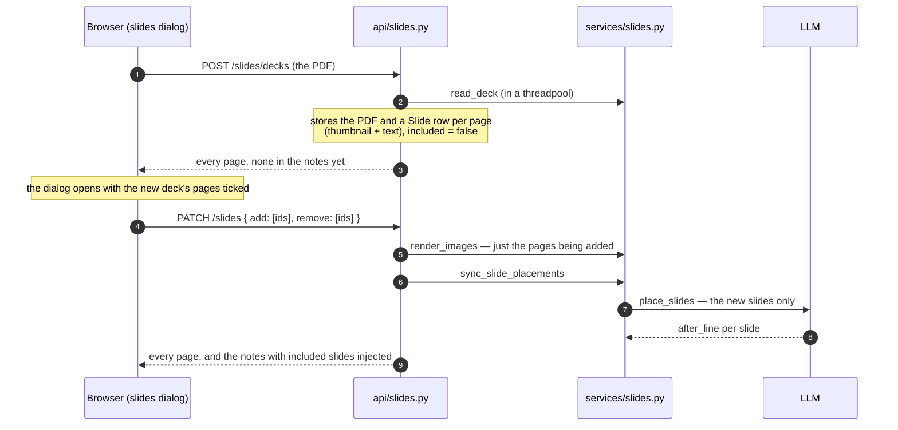
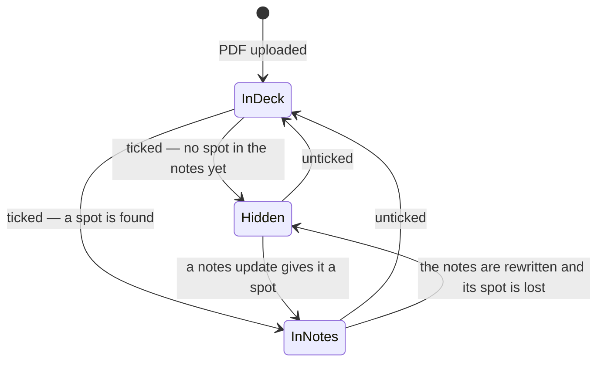
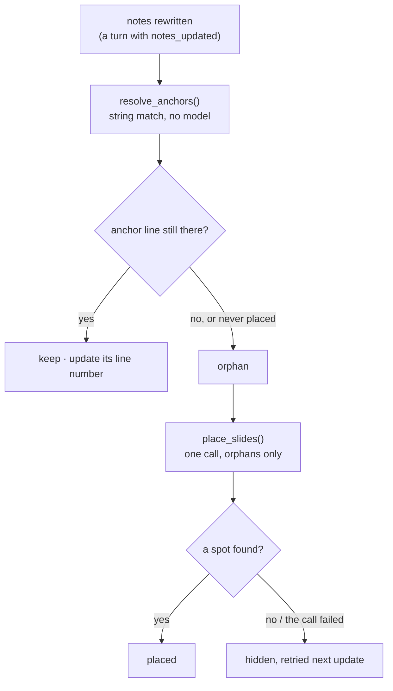
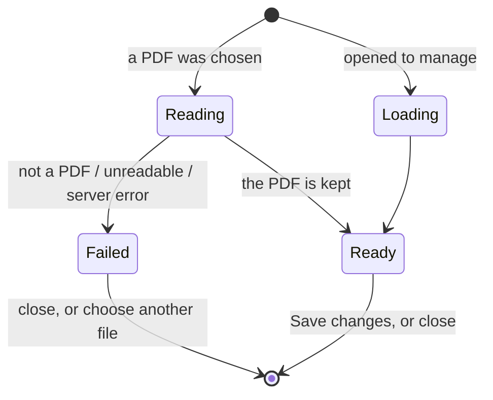

# Slides

## What it does

Once a conversation has notes, you can upload the lecture's slides as a PDF and have
each slide appear in the notes **at the right spot** — after the part of the notes it
belongs to.

The whole PDF is **kept** with the conversation. The slides dialog shows *every page*,
with a check on the ones that are in the notes:

- **Tick a page** to put just that page in the notes.
- **Untick a page** to take just that page out. It stays in the deck, so you can tick it
  again later without uploading anything.
- **Upload another PDF** and it appears as a second section, beside the first.
- **Remove a PDF** to forget it entirely.

Saving sends only what changed, so nothing already in the notes is redone. A page the AI
cannot find a spot for yet (a title slide, or material the lecture hasn't reached) is
**kept but hidden** until a later notes update gives it one.

You reach it from the composer's **+** menu: *Upload slides* before any PDF is kept, and
*Manage slides* after. Slides can only be added once the conversation has notes.

## Where the code lives

| File | Role |
| --- | --- |
| `server/app/services/slides.py` | Reading a PDF; rendering pages; anchoring and placing slides; injecting them into the notes |
| `server/app/api/slides.py` | Upload a deck, add/remove pages, list, delete a deck, serve images |
| `server/app/models/slide_deck.py` | `SlideDeck`: the kept PDF |
| `server/app/models/slide.py` | `Slide`: one row per page, included or not |
| `server/app/db.py` | The additive `ALTER`s that upgrade an older `slides` table |
| `server/app/api/conversations.py` | Re-places slides after a notes rewrite; injects them into the notes it returns |
| `client/src/components/slides-dialog.tsx` | The one dialog: upload, loading, errors, the pages, saving |
| `client/src/components/slide-grid.tsx` | The selectable thumbnail grid (shift-click ranges) |
| `client/src/lib/slides.ts` | `slideIdFromSrc`, `resolveSlideSrc`, `toggleSelection`, `slideCountLabel` |
| `client/src/components/markdown.tsx` | Renders a slide image in the notes (capped at 640 px wide, centred) |
| `client/src/components/notes-panel.tsx` | The "N slides aren't in your notes yet" notice |
| `client/src/components/chat-composer.tsx` | The "+" menu items |
| `server/tests/system/llm_stub.py` | The `SlidePlacements` answer the acceptance tests rely on |

## Flows

### Keep a PDF, then choose pages

Uploading and choosing are separate steps. The upload keeps everything cheap to keep and
puts nothing in the notes; the choice is a small, incremental change.



### What each action costs

| Action | Work done |
| --- | --- |
| Upload a PDF | A thumbnail and the text of every page; the PDF is stored. No full-size render, no model call. |
| Tick pages | A full-size render of *those pages*, from the stored PDF, then a placement call for *those slides only*. Slides already in the notes resolve by string match and are never re-sent to the model. |
| Untick pages | Those slides leave the notes and drop their full-size image. Nothing else is re-run and no model is called. They stay in the deck. |
| Tick a removed page again | The same as a new page — rendered from the kept PDF, no upload. |
| Remove a PDF | The deck and all its pages are deleted. |

### The life of a page



*InDeck* pages have a thumbnail and text but no full-size image. *Hidden* pages are
included but not placed: kept, out of the notes, retried after every notes update.

### Staying in place while the notes change

The notes are one document the AI rewrites wholesale, so a slide cannot be given a
position that survives a rewrite. The design has four parts:

1. **The notes stay clean.** Slides are never written into `note_content`, so the writer
   cannot drop or mangle them and its prompts do not know they exist. The image markdown
   is added only when the notes are *returned* to the client.
2. **Each included slide keeps an anchor:** the exact text of the line it follows, and the
   nearest heading above it.
3. **After every notes rewrite,** `resolve_anchors()` re-finds each anchor by plain string
   match — no model. Only slides whose line disappeared, and slides never placed, go to
   `place_slides()`.
4. **Where an image lands** is snapped to the end of its block, so it never splits a code
   fence, a `$$` math block, a table or a paragraph.



A placement failure is logged and swallowed. A slide problem never fails a turn that has
already produced notes.

### The dialog



Loading and errors are shown **inside the dialog**, where the user is looking, rather than
somewhere on the page behind it. A wrong file type is caught without asking the server. If
the page and the server are out of step — the server has no such endpoint, typically just after
an update — the message asks for a refresh ("This isn't available right now. Please refresh the
page and try again.") rather than showing "Not Found" or anything about servers or deploys.

## Data and API

`slide_decks`: `id`, `conversation_id`, `filename`, `page_count`, `pdf` (deferred).
`slides`: `id`, `conversation_id`, `deck_id`, `position`, `page_number`, `included`,
`thumbnail` and `image` (both deferred), `image_type`, `text`, and the placement:
`anchor_text`, `anchor_heading`, `after_line`.

| Endpoint | Purpose |
| --- | --- |
| `POST /conversations/{id}/slides/decks` | Keep an uploaded PDF. 409 until the conversation has notes |
| `PATCH /conversations/{id}/slides` | `{add, remove}` slide ids. Only the named pages are touched. Ids already in the requested state, or in another conversation, are ignored |
| `GET /conversations/{id}/slides` | Every page of every deck, with `included` and `placed` |
| `DELETE /conversations/{id}/slides/decks/{deck_id}` | Forget a PDF and its pages |
| `GET /slides/{id}/image` · `/thumbnail` | The bytes: immutable and cached forever. A page not in the notes has a thumbnail but no image (404) |

Limits: 30 MB per PDF, 200 pages per PDF, 300 pages per conversation across all decks.
`GET /conversations/{id}` reports `slide_count` — every kept page, so the client knows a
deck exists even when nothing is ticked.

**Older data.** Slides stored before decks were kept have no deck and no PDF. `init_db()`
adds the new columns; those slides stay in the notes, can be removed, but cannot be added
back (the dialog shows them under "Earlier uploads"). Removing one deletes it, since there
is nothing to keep it from.

## Design decisions

- **Keep the PDF, not a render of every page.** The PDF is one compact row; rendering all
  pages eagerly would spend compute and storage on pages nobody ticks. Full-size images are
  made on demand and dropped again when a page is unticked.
- **A row per page from the start.** Every page exists as a `Slide` (thumbnail and text)
  the moment it is uploaded, so the dialog can show the whole deck and "included" is just a
  flag.
- **Diff-based saving.** The dialog sends `add` and `remove` — the difference from what the
  server has — so ticking one page never re-renders or re-places another.
- **Hidden, not dumped at the end.** An earlier version put unplaced slides under a
  "Slides" heading at the bottom of the notes; in a live lecture that fills with slides for
  material not yet covered. Hiding them keeps the notes clean, and the notice and the
  "Not placed yet" label mean nothing looks lost.
- **Heavy columns are deferred.** `image`, `thumbnail` and `pdf` are never loaded by the
  per-turn work (anchoring, injecting) — only by the code that needs the bytes.
- **PDF work runs in a threadpool** so it cannot stall the event loop that also serves the
  live-transcription WebSocket.
- **Slide images have a width cap** (640 px, centred). Slides are rendered 1280 px wide and
  the notes panel has no maximum width of its own, so without a cap a slide would grow to
  fill a very wide panel.
- **Slides in the notes have no remove button.** Removing goes through the dialog, so there
  is one place to manage them and one code path.

## Tests

This is the most heavily tested feature: the pure logic in unit tests, the API against a
real Postgres, and every user-facing flow in a browser. The model is stubbed at one seam,
`place_slides`, which the integration tests replace with a fake that **records which slides
it was asked about** — that is how "only the new page was sent" is asserted.

<!--snip: server/tests/integration/test_slides_api.py | def test_adding_one_more_later_places_only_that_one | auto -->
```python
def test_adding_one_more_later_places_only_that_one(self, client: TestClient, db: Session, placer) -> None:
    placer.answers.update({1: 2, 2: 6, 3: 6})
    conversation = make_conversation(db)
    deck = upload(client, conversation).json()
    first = change(client, conversation, add=ids_of(deck, 1, 2)).json()
    anchors_before = {s.page_number: (s.after_line, s.anchor_text) for s in db.query(Slide).filter(Slide.included)}
    placer.calls.clear()

    body = change(client, conversation, add=ids_of(first, 3)).json()

    assert placer.calls == [[3]], "the two slides already in the notes were not sent to the model again"
    anchors_after = {s.page_number: (s.after_line, s.anchor_text) for s in db.query(Slide).filter(Slide.included)}
    for page in (1, 2):
        assert anchors_after[page] == anchors_before[page], "and kept exactly the spot they had"
    assert [s["included"] for s in body["slides"]] == [True, True, True, False]
```

And in a browser, watching the requests the page actually makes:

<!--snip: client/e2e/slides.spec.ts | test("adding one more page sends only that page | auto -->
```ts
test("adding one more page sends only that page — nothing is uploaded again, nothing already there is redone", async ({
  page,
}) => {
  await startNotes(page)
  await addSlides(page, 3)
  const seen = trackSlideRequests(page)

  const dialog = await openManage(page)
  await dialog.getByRole("checkbox").nth(3).click()
  await expect(dialog.getByText("Adding 1")).toBeVisible()
  await save(page, dialog)

  await expect(slideImages(page)).toHaveCount(4)
  expect(uploads(seen)).toHaveLength(0)
  const [change] = patches(seen)
  expect(patches(seen)).toHaveLength(1)
  expect(change!.add).toHaveLength(1)
  expect(change!.remove).toHaveLength(0)
})
```

| Group | File | What it proves |
| --- | --- | --- |
| `TestNotesWithSlides` | `unit/test_slides.py` | An image is inserted after the end of its paragraph, never mid-paragraph; never inside a code fence (even across a blank line in it), a math block or a table; several slides at one spot keep deck order; unplaced and out-of-range slides are hidden; the stored notes are not mutated; alt text cannot break the Markdown |
| `TestIsPlaced`, `TestIncludedFilter` | same | The one definition of "placed"; pages not in the notes are never rendered into them |
| `TestResolveAnchors` | same | An anchor records its line and heading; a blank-line choice snaps up to text; an unchanged line is kept and re-indexed; a reworded line orphans the slide; a repeated line prefers the same heading |
| `TestBatches`, `TestPdfRendering` | same | Placement requests are capped in slides and in images; a deck yields a thumbnail and text per page without full-size renders; only asked-for pages are rendered; garbage, out-of-range pages and too many pages are rejected |
| `TestUploadDeck` | `integration/test_slides_api.py` | Every page is kept, none in the notes; no model call and no full-size image; the PDF is kept; a second upload is a second deck; a filename's path is stripped; refused (409) without notes; a non-PDF is a 400 that keeps nothing |
| `TestAddingPages` | same | Only ticked pages are rendered and placed; adding one later sends only that one and leaves the others' spots alone; ticking an already-included page does nothing; unknown and other-conversation ids are ignored; adding needs notes; a placement failure still adds the page but hides it |
| `TestRemovingPages` | same | Removing touches only that page and calls no model; the page stays with its thumbnail; it can be added back with no re-upload; removing needs no notes; add and remove in one request; an early slide with no deck is deleted |
| `TestDeleteDeck` | same | Removes the PDF, its pages and their images; leaves other decks alone; unknown or foreign decks are 404; deleting the conversation deletes decks and slides |
| `TestImages` | same | Long cache headers; every page has a thumbnail from upload; a page not in the notes has no full-size image; ETag revalidation; unknown slide is 404 |
| `TestUnplacedSlidesAreHidden`, `TestTurnsKeepSlidesPlaced` | same | `placed` is reported honestly; hidden slides are not in the notes; a hidden slide appears once a later notes update covers it; an untouched anchor survives a rewrite with no model call; unticked pages are never sent to the model; a reworded anchor is re-placed; a failure never fails the turn |
| `slideIdFromSrc`, `resolveSlideSrc`, `toggleSelection`, `slideCountLabel` | `client/src/lib/slides.test.ts` | Recognising an injected slide image (and not a lookalike URL); pointing it at the API; click and shift-click selection, forwards and backwards, without mutating the old set; pluralising |
| `Slides` | `client/e2e/slides.spec.ts` | See below |

The browser tests, in `slides.spec.ts`: slides can't be added until notes exist; the "+" menu
offers audio and slides and opens the dialog; a new PDF opens ticked and saving puts the
ticked pages in the notes; slides sit after their section; the dialog lists the whole PDF
checked where it is in the notes; **adding one page sends only that page**; **removing one
sends only that page and it can be added back with no upload**; add and remove in one save;
Save is off until something changes and closing sends nothing; closing after an upload keeps
the PDF; a second PDF sits beside the first; a page with no spot is hidden, announced and
labelled; removing a PDF; images never exceed 640 px; the menu says Manage slides; the X;
the loading state, a non-PDF, an unreadable PDF and an endpoint the server does not have are
all shown inside the dialog as plain sentences; everything survives a reload and a further turn.

```bash
cd server && pytest tests/unit/test_slides.py tests/integration/test_slides_api.py -q
cd client && npx vitest run src/lib/slides.test.ts
cd client && npx playwright test slides.spec.ts        # needs the test stack
```

**Not covered**

- **Placement quality with a real model.** `place_slides` is stubbed, so nothing checks that a
  real model puts a slide in a sensible spot, or how it handles a poor match.
- **The vision path** — image-only slides sent to the model as pictures — is not exercised
  end to end; only the batching arithmetic that caps it is unit tested.
- **Large decks and load.** Nothing tests a 200-page PDF, the 30 MB limit, or the 300-page cap.
- **The upgrade path from an older schema** is checked by hand (an old-format table with a
  row in it), not by an automated test.
- **Pointer behavior in the grid** — actual shift-click in the dialog — is covered by the
  `toggleSelection` unit tests, not by a browser test.
