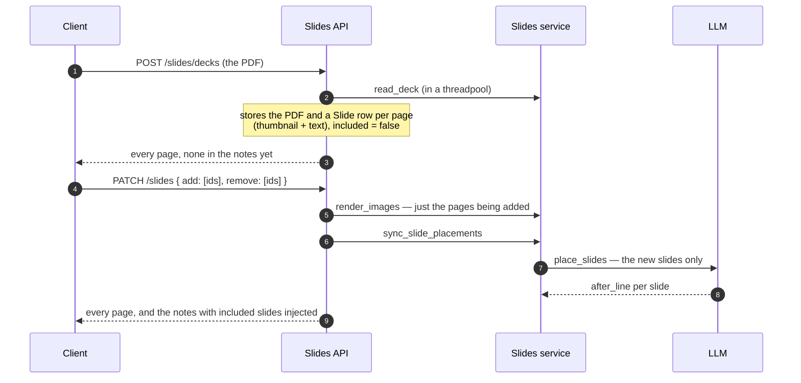
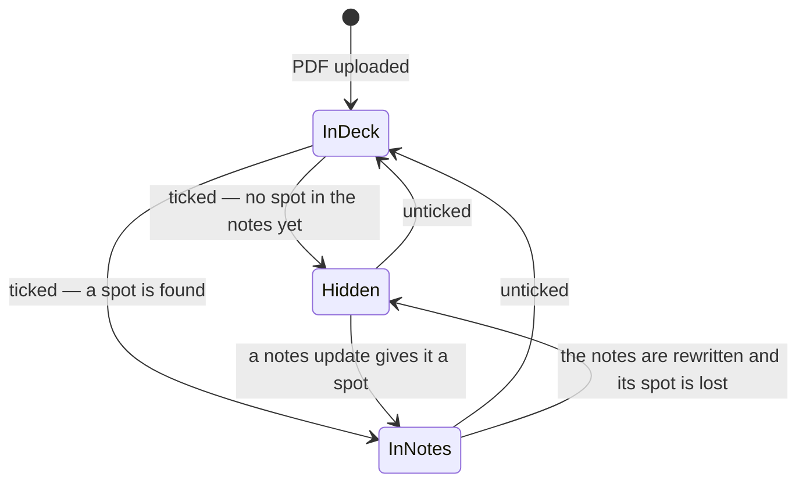
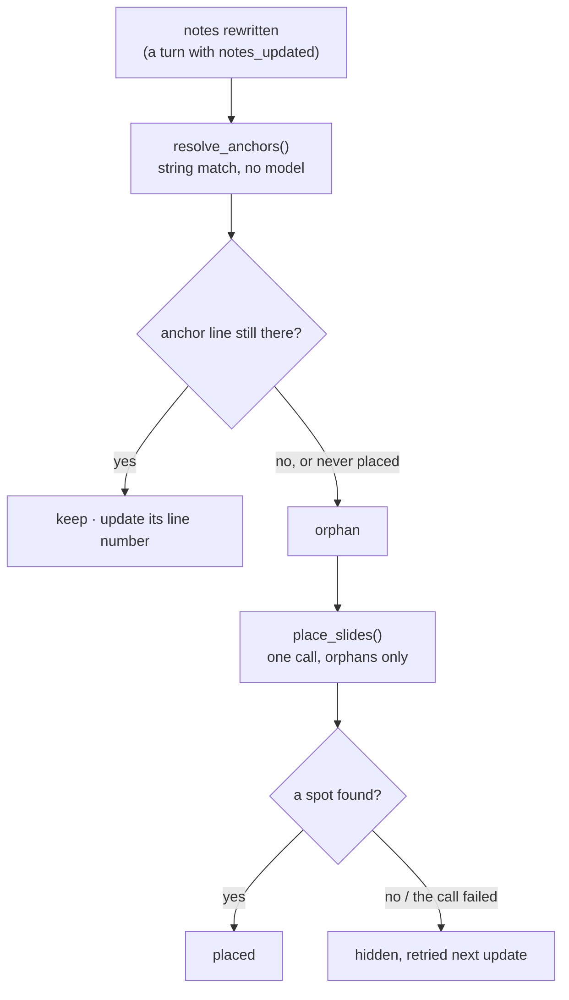

# Slides

## What it does

Once a conversation has notes, you can upload the lecture's slides as a PDF and have
each slide appear in the notes **at the right spot** — after the part of the notes it
belongs to.

The whole PDF is **kept** with the conversation. Every page of the deck is listed,
with a check on the ones that are in the notes:

- **Tick a page** to put just that page in the notes.
- **Untick a page** to take just that page out. It stays in the deck, so you can tick it
  again later without uploading anything.
- **Upload another PDF** and it appears as a second section, beside the first.
- **Remove a PDF** to forget it entirely.

Saving sends only what changed, so nothing already in the notes is redone. A page the AI
cannot find a spot for yet (a title slide, or material the lecture hasn't reached) is
**kept but hidden** until a later notes update gives it one.

Slides can only be added once the conversation has notes.

## Flows

### Keep a PDF, then choose pages

Uploading and choosing are separate steps. The upload keeps everything cheap to keep and
puts nothing in the notes; the choice is a small, incremental change.

```mermaid
sequenceDiagram
  autonumber
  participant U as Client
  participant A as Slides API
  participant S as Slides service
  participant L as LLM

  U->>A: POST /slides/decks (the PDF)
  A->>S: read_deck (in a threadpool)
  Note over A: stores the PDF and a Slide row per page<br/>(thumbnail + text), included = false
  A-->>U: every page, none in the notes yet
  U->>A: PATCH /slides { add: [ids], remove: [ids] }
  A->>S: render_images — just the pages being added
  A->>S: sync_slide_placements
  S->>L: place_slides — the new slides only
  L-->>S: after_line per slide
  A-->>U: every page, and the notes with included slides injected
```

### What each action costs

| Action | Work done |
| --- | --- |
| Upload a PDF | A thumbnail and the text of every page; the PDF is stored. No full-size render, no model call. |
| Tick pages | A full-size render of *those pages*, from the stored PDF, then a placement call for *those slides only*. Slides already in the notes resolve by string match and are never re-sent to the model. |
| Untick pages | Those slides leave the notes and drop their full-size image. Nothing else is re-run and no model is called. They stay in the deck. |
| Tick a removed page again | The same as a new page — rendered from the kept PDF, no upload. |
| Remove a PDF | The deck and all its pages are deleted. |

### The life of a page

```mermaid
stateDiagram-v2
  [*] --> InDeck: PDF uploaded
  InDeck --> Hidden: ticked — no spot in the notes yet
  InDeck --> InNotes: ticked — a spot is found
  Hidden --> InNotes: a notes update gives it a spot
  InNotes --> InDeck: unticked
  Hidden --> InDeck: unticked
  InNotes --> Hidden: the notes are rewritten and its spot is lost
```

*InDeck* pages have a thumbnail and text but no full-size image. *Hidden* pages are
included but not placed: kept, out of the notes, retried after every notes update.

### Staying in place while the notes change

The notes are one document the AI rewrites wholesale, so a slide cannot be given a
position that survives a rewrite. The design has four parts:

1. **The notes stay clean.** Slides are never written into `note_content`, so the writer
   cannot drop or mangle them and its prompts do not know they exist. The image markdown
   is added only when the notes are *returned* to the client.
2. **Each included slide keeps an anchor:** the exact text of the line it follows, and the
   nearest heading above it.
3. **After every notes rewrite,** `resolve_anchors()` re-finds each anchor by plain string
   match — no model. Only slides whose line disappeared, and slides never placed, go to
   `place_slides()`.
4. **Where an image lands** is snapped to the end of its block, so it never splits a code
   fence, a `$$` math block, a table or a paragraph.

```mermaid
flowchart TD
  R["notes rewritten<br/>(a turn with notes_updated)"] --> A["resolve_anchors()<br/>string match, no model"]
  A --> K{"anchor line still there?"}
  K -->|yes| KEEP["keep · update its line number"]
  K -->|no, or never placed| O["orphan"]
  O --> P["place_slides()<br/>one call, orphans only"]
  P --> V{"a spot found?"}
  V -->|yes| PLACED["placed"]
  V -->|no / the call failed| HID["hidden, retried next update"]
```

A placement failure is logged and swallowed. A slide problem never fails a turn that has
already produced notes.

## Design decisions

- **Keep the PDF, not a render of every page.** The PDF is one compact row; rendering all
  pages eagerly would spend compute and storage on pages nobody ticks. Full-size images are
  made on demand and dropped again when a page is unticked.
- **A row per page from the start.** Every page exists as a `Slide` (thumbnail and text)
  the moment it is uploaded, so the whole deck can be listed and "included" is just a
  flag.
- **Diff-based saving.** The client sends `add` and `remove` — the difference from what the
  server has — so ticking one page never re-renders or re-places another.
- **Hidden, not dumped at the end.** An earlier version put unplaced slides under a
  "Slides" heading at the bottom of the notes; in a live lecture that fills with slides for
  material not yet covered. Hiding them keeps the notes clean, and they stay visible in the deck's page list, so nothing looks lost.
- **Heavy columns are deferred.** `image`, `thumbnail` and `pdf` are never loaded by the
  per-turn work (anchoring, injecting) — only by the code that needs the bytes.
- **PDF work runs in a threadpool** so it cannot stall the event loop that also serves the
  live-transcription WebSocket.

