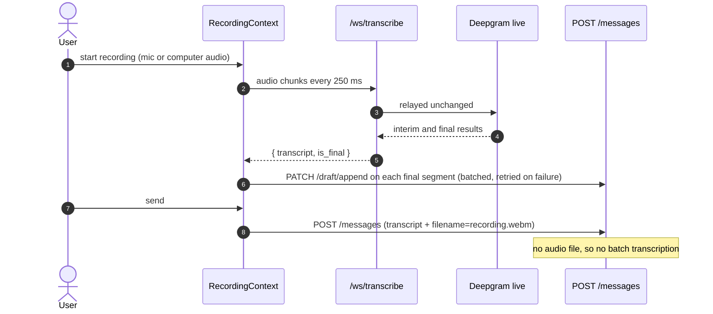
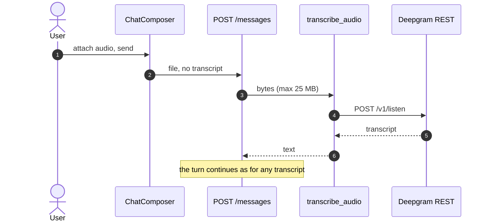
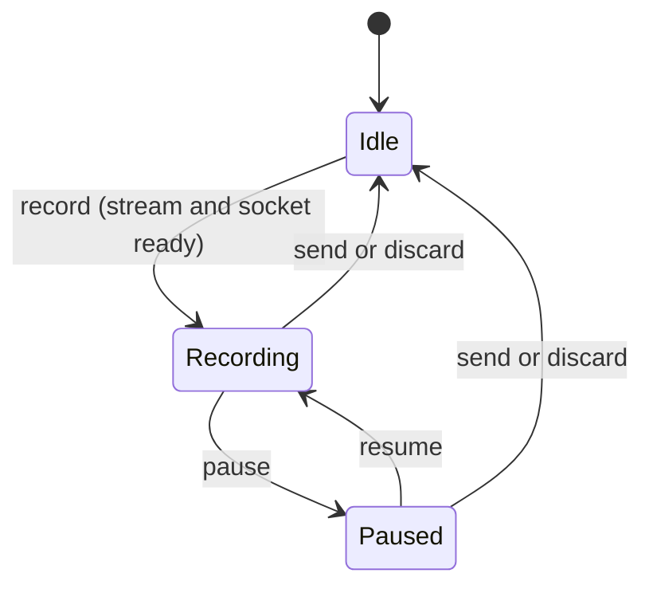
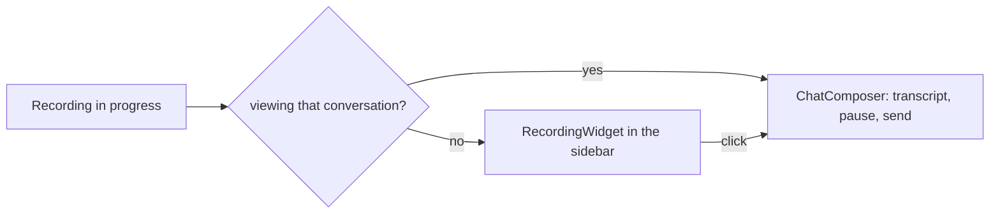

# Transcription

## What it does

Turns speech into the text the notes are built from. There are two ways in:

- **Live recording** — press record (microphone or computer audio) and a transcript
  appears as you speak. Recording keeps going while you browse other conversations, and a
  small widget in the sidebar shows it is still live.
- **Audio upload** — attach an audio file from the "+" menu (or drop it on the composer).
  There is no live transcript, so the server transcribes the whole file when you send.

Either way, **the model never hears audio** — only the transcript text. Audio bytes are
not stored; only the transcript and a filename are.

## Where the code lives

| File | Role |
| --- | --- |
| `server/app/api/live_transcribe.py` | `WS /ws/transcribe`: proxies audio to Deepgram's live API and relays transcripts back, so the API key never reaches the browser |
| `server/app/services/transcription.py` | `transcribe_audio()`: Deepgram's batch REST API, for uploaded files |
| `server/app/api/conversations.py` | Receives the result: a file (batch) or a `transcript` + `filename` (live) |
| `client/src/lib/recording-context.tsx` | The recording engine: `MediaRecorder`, the socket, the live transcript, pause, the timer |
| `client/src/components/recording-widget.tsx` | The floating controls when you are on another page mid-recording |
| `client/src/components/chat-composer.tsx` | Starting, pausing, discarding and sending; attaching a file |
| `client/src/components/message-bubble.tsx` | `isFileAttachment()` tells an upload from a live recording |

## Flows

### Live recording

`MediaRecorder` emits an audio chunk every 250 ms. The chunks stream over a WebSocket to
`/ws/transcribe`, which relays them to Deepgram and passes the transcript back. On send,
the accumulated transcript is what becomes the message.



Closing the client side sends Deepgram a `CloseStream`, which makes it flush whatever it
is still finalizing (usually the last utterance). The proxy then waits up to five seconds
for that flushed result to come back before tearing down. Without that wait the last
sentence of a recording was being dropped in a race between the two relay tasks.

### Audio upload

The attached file is the only input. The server must transcribe it.



The chat shows the upload as a box with the real filename that opens to its transcript.
A live recording stores `filename=recording.webm` as metadata only, and shows as a normal
message — `isFileAttachment()` is what tells the two apart.

### The recording's lifecycle



Pause does **not** split the recording — the same `MediaRecorder` session keeps streaming.
Discarding, or sending silence, deletes the conversation only if it was created just for
that recording and never successfully sent.

### It survives navigation

`RecordingProvider` sits **above the router**, so changing pages does not stop the mic.



On a phone-sized screen the sidebar is a closed drawer, so the sidebar's menu button
shows a small pulsing red dot while a recording is live. See [Layout](../layout/README.md).

### Draft autosave

Each final Deepgram segment (and pause) autosaves — but not one call each: a short
batching delay lets several finals arriving in a burst share one request
(`scheduleDraftSave`; pausing flushes immediately instead of waiting,
`flushDraftSave`), and only the newest text is sent, via `PATCH
/conversations/{id}/draft/append`, not the whole transcript so far. The server stores
each append as its own row (`draft_chunks`) rather than rewriting one growing column,
so autosaving stays cheap regardless of how long the recording has run — see
[Conversations](../conversations/README.md#data-and-api). A failed append retries on
its own with jittered exponential backoff rather than waiting for the next final to
happen to cover it.

After a crash or a reload, `GET /conversations/{id}` reassembles those chunks into
`draft_transcript` and the composer restores it, so a tab dying mid-lecture does not
lose it. A successful send clears the draft (`PATCH /conversations/{id}/draft`, the
full-replace endpoint, used only to reset it to nothing). Guards stop a late WebSocket
message from resurrecting a draft the user discarded (`allowDraftSaveRef`, and clearing
`onmessage` before closing).

## Data and API

| Piece | Detail |
| --- | --- |
| `WS /ws/transcribe?conversation_id=` | The `conversation_id` is only for logging: it tags every log line so one recording can be traced end to end |
| Deepgram live | `nova-2`, `smart_format`, `interim_results` |
| Deepgram batch | `nova-2`, `smart_format`, a 60 s timeout |
| `POST /conversations/{id}/messages` | Either `file`, or `transcript` (+ optional `filename`) |
| `messages.filename` | The upload's own name, or `recording.webm` for a live recording |

Failure modes. What the person reads is written for them — no keys, no provider names, no
status codes, none of Deepgram's own error body (that is logged, not shown):

| Situation | Status | What the person sees |
| --- | --- | --- |
| No `DEEPGRAM_API_KEY` (a deployment problem) | WebSocket closes `1011`; batch `503` | "Transcription isn't available right now. Please try again later." |
| Deepgram returns an error | `502` | "Transcription failed. Please try again." |
| An unexpected response shape | `502` | the same sentence |
| The file is larger than 25 MB | `413` | "That file is too large. Audio files can be up to 25 MB." |
| Silence / a file with no speech | `400` | "We couldn't hear any speech in that recording. Please try again." — nothing is saved |

## Design decisions

- **A server-side WebSocket proxy** rather than connecting the browser straight to
  Deepgram, because a direct connection would put the API key in the browser.
- **The recording engine lives above the router**, in `RecordingProvider`. It used to
  live inside the composer, so navigating away mid-recording tore the whole session down.
- **Live sends carry text, not audio.** The transcript already exists, so uploading the
  audio again would only cost bandwidth and a second, possibly different, transcription.
- **Silence is rejected before anything is saved**, so the conversation keeps its
  placeholder title and no blank message is stored.

## Tests

This is the least-covered feature, and this page says so plainly. The **server-side
handling of a transcript** is well covered; **the audio paths themselves are not**,
because Deepgram cannot be redirected at a stub — `DEEPGRAM_LIVE_URL` and
`DEEPGRAM_TRANSCRIPTION_URL` are module constants, not settings.

What does run is the live-recording *message* path — a transcript plus a filename, with no
audio file:

<!--snip: server/tests/integration/test_conversations_api.py | def test_live_recording_sets_filename_without_audio_file | auto -->
```python
def test_live_recording_sets_filename_without_audio_file(
    self, client: TestClient, db: Session, stub_llm
) -> None:
    # Live path: transcript + filename metadata, no multipart file.
    stub_llm()
    conversation = _make_conversation(db)

    response = client.post(
        f"/conversations/{conversation.id}/messages",
        data={"transcript": "lecture content", "filename": "recording.webm"},
    )

    assert response.status_code == 200
    user = db.query(Message).filter_by(role="user").one()
    assert user.content == "lecture content"
    assert user.filename == "recording.webm"
```

| Group | File | What it proves |
| --- | --- | --- |
| `TestSendMessage` (live recording) | `integration/test_conversations_api.py` | A transcript with a filename and no file is saved as the user turn, with the filename recorded and no audio |
| `TestSendMessageRejections` | same | A whitespace-only transcript — what silence becomes — is rejected with 400, stores nothing, and keeps the placeholder title |
| `TestErrorHandling` (silent recording) | `system/test_stack.py` | The same rejection through the real stack |
| `TestConversationJourney` (draft) | same | The draft endpoint round-trips through the real stack |
| "a long transcript of an uploaded audio file…", "an uploaded audio file and its transcript are one box" | `e2e/messages.spec.ts` | How an uploaded file *looks* in the chat — one box, the filename on top, the transcript opening beneath it and collapsing when long — using messages seeded through the API with a filename |
| "the audio item opens an audio-only file chooser" | `e2e/slides.spec.ts` | The "+" menu's audio item opens a file chooser that accepts audio |

```bash
cd server && pytest tests/integration/test_conversations_api.py -k "live_recording or Rejections" -q
cd server && pytest tests/system/test_stack.py -k "silent or draft" -q          # needs the test stack
cd client && npx playwright test messages.spec.ts -g "uploaded audio"           # needs the test stack
```

**Not covered**

- **Uploading an audio file end to end.** No integration, system or acceptance test posts a
  file, so `transcribe_audio`, the 25 MB limit and the Deepgram error handling are
  untested. (An earlier version of the README claimed the integration layer covered this
  by stubbing `transcribe_audio`. It does not.)
- **The live WebSocket proxy** and the CloseStream flush that fixed the dropped last
  sentence: no test connects to `/ws/transcribe`.
- **The recording engine in the browser** (`MediaRecorder`, pause and resume, the timer,
  the floating widget, surviving navigation): there is no acceptance test that records,
  since a headless browser has no microphone.
- **Draft autosave on the client** — restoring a recovered draft into the composer. Only
  the server endpoint is tested.
