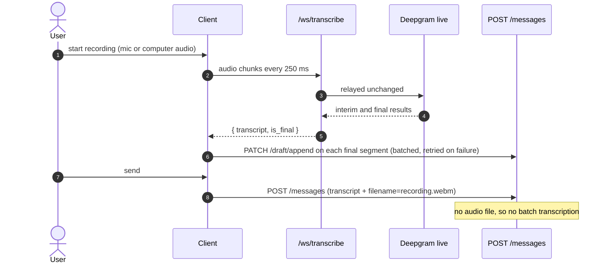
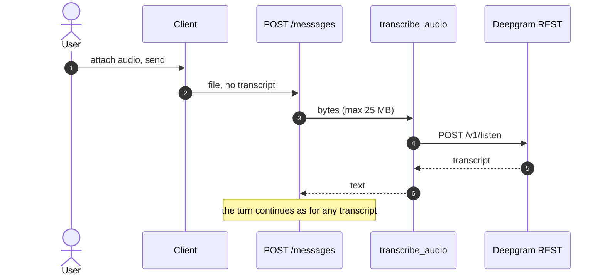

# Transcription

## What it does

Turns speech into the text the notes are built from. There are two ways in:

- **Live recording** — press record (microphone or computer audio) and a transcript
  appears as you speak.
- **Audio upload** — attach an audio file.
  There is no live transcript, so the server transcribes the whole file when you send.

Either way, **the model never hears audio** — only the transcript text. Audio bytes are
not stored; only the transcript and a filename are.

## Flows

### Live recording

The client emits an audio chunk every 250 ms. The chunks stream over a WebSocket to
`/ws/transcribe`, which relays them to Deepgram and passes the transcript back. On send,
the accumulated transcript is what becomes the message.

```mermaid
sequenceDiagram
  autonumber
  actor U as User
  participant RC as Client
  participant WS as /ws/transcribe
  participant DG as Deepgram live
  participant API as POST /messages

  U->>RC: start recording (mic or computer audio)
  RC->>WS: audio chunks every 250 ms
  WS->>DG: relayed unchanged
  DG-->>WS: interim and final results
  WS-->>RC: { transcript, is_final }
  RC->>API: PATCH /draft/append on each final segment (batched, retried on failure)
  U->>RC: send
  RC->>API: POST /messages (transcript + filename=recording.webm)
  Note over API: no audio file, so no batch transcription
```

Closing the client side sends Deepgram a `CloseStream`, which makes it flush whatever it
is still finalizing (usually the last utterance). The proxy then waits up to five seconds
for that flushed result to come back before tearing down. Without that wait the last
sentence of a recording was being dropped in a race between the two relay tasks.

### Audio upload

The attached file is the only input. The server must transcribe it.

```mermaid
sequenceDiagram
  autonumber
  actor U as User
  participant CC as Client
  participant API as POST /messages
  participant TR as transcribe_audio
  participant DG as Deepgram REST

  U->>CC: attach audio, send
  CC->>API: file, no transcript
  API->>TR: bytes (max 25 MB)
  TR->>DG: POST /v1/listen
  DG-->>TR: transcript
  TR-->>API: text
  Note over API: the turn continues as for any transcript
```

### Draft autosave

Each final Deepgram segment (and pause) autosaves — but not one call each: a short
batching delay lets several finals arriving in a burst share one request
(pausing flushes immediately instead of waiting), and only the newest text is sent, via `PATCH
/conversations/{id}/draft/append`, not the whole transcript so far. The server stores
each append as its own row (`draft_chunks`) rather than rewriting one growing column,
so autosaving stays cheap regardless of how long the recording has run — see
[Conversations](../conversations/README.md). A failed append retries on
its own with jittered exponential backoff rather than waiting for the next final to
happen to cover it.

After a crash or a reload, `GET /conversations/{id}` reassembles those chunks into
`draft_transcript` and the client restores it, so a tab dying mid-lecture does not
lose it. A successful send clears the draft (`PATCH /conversations/{id}/draft`, the
full-replace endpoint, used only to reset it to nothing). A late WebSocket message cannot resurrect a draft the user discarded.

## Design decisions

- **A server-side WebSocket proxy** rather than connecting the browser straight to
  Deepgram, because a direct connection would put the API key in the browser.
- **Live sends carry text, not audio.** The transcript already exists, so uploading the
  audio again would only cost bandwidth and a second, possibly different, transcription.
- **Silence is rejected before anything is saved**, so the conversation keeps its
  placeholder title and no blank message is stored.

